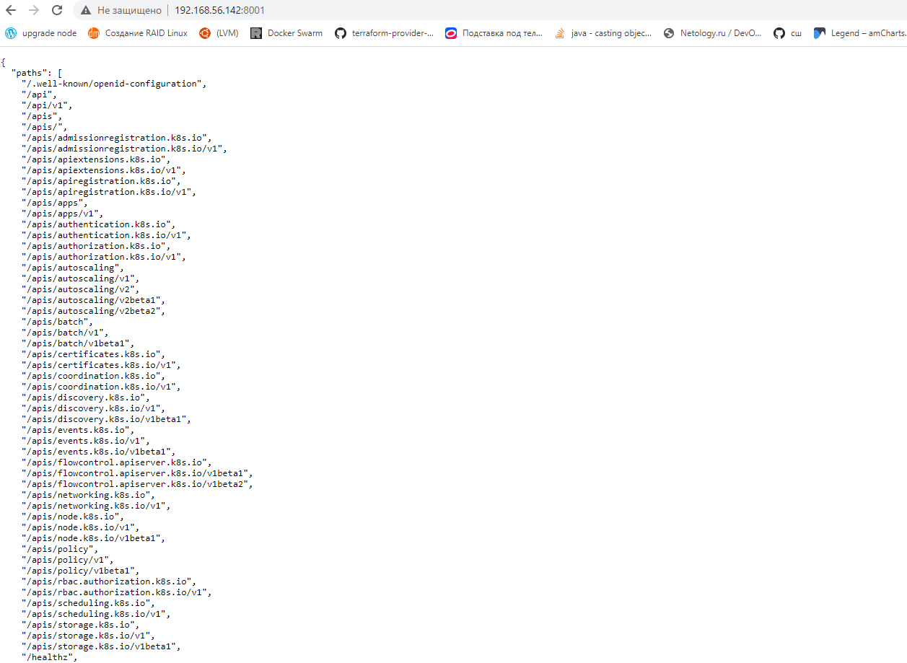
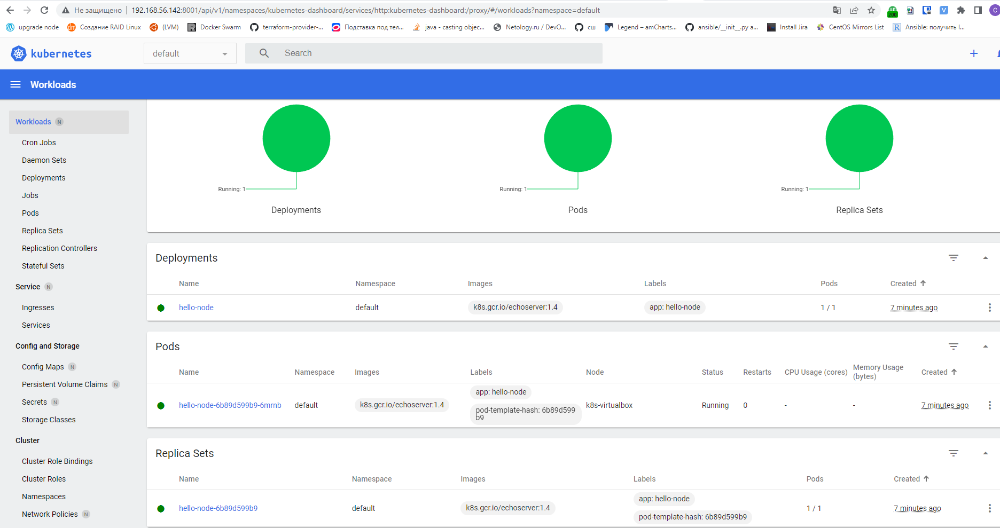

minikube version
minikube version: v1.25.2
commit: 362d5fdc0a3dbee389b3d3f1034e8023e72bd3a7


minikube status
minikube
type: Control Plane
host: Running
kubelet: Running
apiserver: Running
kubeconfig: Configured


kubectl get pods --namespace=kube-system
NAME                                     READY   STATUS    RESTARTS   AGE
coredns-64897985d-24f9l                  1/1     Running   0          21s
etcd-k8s-virtualbox                      1/1     Running   0          33s
kube-apiserver-k8s-virtualbox            1/1     Running   0          33s
kube-controller-manager-k8s-virtualbox   1/1     Running   0          35s
kube-proxy-9jdss                         1/1     Running   0          21s
kube-scheduler-k8s-virtualbox            1/1     Running   0          35s
storage-provisioner                      1/1     Running   0          31s


#Задача 1: Установить Minikube

Для экспериментов и валидации ваших решений вам нужно подготовить тестовую среду для работы с Kubernetes. Оптимальное решение — развернуть на рабочей машине Minikube.

<details><summary>Как поставить на AWS</summary>

*   создать EC2 виртуальную машину (Ubuntu Server 20.04 LTS (HVM), SSD Volume Type) с типом t3.small. Для работы потребуется настроить Security Group для доступа по ssh. Не забудьте указать keypair, он потребуется для подключения.
*   подключитесь к серверу по ssh (ssh ubuntu@<ipv4_public_ip> -i .pem)
*   установите миникуб и докер следующими командами:
````
curl -LO https://storage.googleapis.com/kubernetes-release/release/`curl -s https://storage.googleapis.com/kubernetes-release/release/stable.txt`/bin/linux/amd64/kubectl
chmod +x ./kubectl
sudo mv ./kubectl /usr/local/bin/kubectl
sudo apt-get update && sudo apt-get install docker.io conntrack -y
curl -Lo minikube https://storage.googleapis.com/minikube/releases/latest/minikube-linux-amd64 && chmod +x minikube && sudo mv minikube /usr/local/bin/
````
*   проверить версию можно командой minikube version
*   переключаемся на root и запускаем миникуб: minikube start --vm-driver=none
*   после запуска стоит проверить статус: minikube status
*   запущенные служебные компоненты можно увидеть командой: kubectl get pods --namespace=kube-system
*   Для сброса кластера стоит удалить кластер и создать заново:
````
minikube delete
minikube start --vm-driver=none
````

Возможно, для повторного запуска потребуется выполнить команду: sudo sysctl fs.protected_regular=0

</details>

Инструкция по установке Minikube - [ссылка](https://kubernetes.io/ru/docs/tasks/tools/install-minikube/)

Установил  Minikube на виртуальную машину.

````
minikube version
minikube version: v1.25.2
commit: 362d5fdc0a3dbee389b3d3f1034e8023e72bd3a7
````

````
minikube start --vm-driver=none
* minikube v1.25.2 on Ubuntu 20.04 (vbox/amd64)
* Using the none driver based on user configuration
* Starting control plane node minikube in cluster minikube
* Running on localhost (CPUs=4, Memory=9955MB, Disk=23597MB) ...
* OS release is Ubuntu 20.04.4 LTS
* Preparing Kubernetes v1.23.3 on Docker 20.10.12 ...
  - kubelet.resolv-conf=/run/systemd/resolve/resolv.conf
  - kubelet.housekeeping-interval=5m
  - Generating certificates and keys ...
  - Booting up control plane ...
  - Configuring RBAC rules ...
* Configuring local host environment ...
*
! The 'none' driver is designed for experts who need to integrate with an existing VM
* Most users should use the newer 'docker' driver instead, which does not require root!
* For more information, see: https://minikube.sigs.k8s.io/docs/reference/drivers/none/
*
! kubectl and minikube configuration will be stored in /root
! To use kubectl or minikube commands as your own user, you may need to relocate them. For example, to overwrite your own settings, run:
*
  - sudo mv /root/.kube /root/.minikube $HOME
  - sudo chown -R $USER $HOME/.kube $HOME/.minikube
*
* This can also be done automatically by setting the env var CHANGE_MINIKUBE_NONE_USER=true
* Verifying Kubernetes components...
  - Using image gcr.io/k8s-minikube/storage-provisioner:v5
* Enabled addons: default-storageclass, storage-provisioner
````

````
minikube status
E0615 16:14:27.521304    5871 status.go:413] kubeconfig endpoint: extract IP: "minikube" does not appear in /root/.kube/config
minikube
type: Control Plane
host: Running
kubelet: Running
apiserver: Running
kubeconfig: Misconfigured
````


# Задача 2: Запуск Hello World

После установки Minikube требуется его проверить. Для этого подойдет стандартное приложение hello world. А для доступа к нему потребуется ingress.

развернуть через Minikube тестовое приложение по туториалу

````
kubectl create deployment hello-node --image=k8s.gcr.io/echoserver:1.4
deployment.apps/hello-node created

kubectl get deployments
NAME         READY   UP-TO-DATE   AVAILABLE   AGE
hello-node   1/1     1            1           35s

kubectl get pods
NAME                          READY   STATUS    RESTARTS   AGE
hello-node-6b89d599b9-6mrnb   1/1     Running   0          57s

kubectl expose deployment hello-node --type=LoadBalancer --port=8080
service/hello-node exposed

kubectl get services
NAME         TYPE           CLUSTER-IP      EXTERNAL-IP   PORT(S)          AGE
hello-node   LoadBalancer   10.97.252.204   <pending>     8080:31428/TCP   9s
kubernetes   ClusterIP      10.96.0.1       <none>        443/TCP          73m

minikube service hello-node

minikube service list | grep hello
| default              | hello-node                         |         8080 | http://10.0.2.15:31428 |

````


### установить аддоны ingress и dashboard

````
minikube addons enable ingress;
minikube addons enable dashboard;
````

minikube addons list

|         ADDON NAME          | PROFILE  |    STATUS    |           MAINTAINER           |
|-----------------------------|----------|--------------|--------------------------------|
| ambassador                  | minikube | disabled     | third-party (ambassador)       |
| auto-pause                  | minikube | disabled     | google                         |
| csi-hostpath-driver         | minikube | disabled     | kubernetes                     |
| dashboard                   | minikube | enabled ✅   | kubernetes                     |
| default-storageclass        | minikube | enabled ✅   | kubernetes                     |
| efk                         | minikube | disabled     | third-party (elastic)          |
| freshpod                    | minikube | disabled     | google                         |
| gcp-auth                    | minikube | disabled     | google                         |
| gvisor                      | minikube | disabled     | google                         |
| helm-tiller                 | minikube | disabled     | third-party (helm)             |
| ingress                     | minikube | enabled ✅   | unknown (third-party)          |
| ingress-dns                 | minikube | disabled     | google                         |
| istio                       | minikube | disabled     | third-party (istio)            |
| istio-provisioner           | minikube | disabled     | third-party (istio)            |
| kong                        | minikube | disabled     | third-party (Kong HQ)          |
| kubevirt                    | minikube | disabled     | third-party (kubevirt)         |
| logviewer                   | minikube | disabled     | unknown (third-party)          |
| metallb                     | minikube | disabled     | third-party (metallb)          |
| metrics-server              | minikube | disabled     | kubernetes                     |
| nvidia-driver-installer     | minikube | disabled     | google                         |
| nvidia-gpu-device-plugin    | minikube | disabled     | third-party (nvidia)           |
| olm                         | minikube | disabled     | third-party (operator          |
|                             |          |              | framework)                     |
| pod-security-policy         | minikube | disabled     | unknown (third-party)          |
| portainer                   | minikube | disabled     | portainer.io                   |
| registry                    | minikube | disabled     | google                         |
| registry-aliases            | minikube | disabled     | unknown (third-party)          |
| registry-creds              | minikube | disabled     | third-party (upmc enterprises) |
| storage-provisioner         | minikube | enabled ✅   | google                         |
| storage-provisioner-gluster | minikube | disabled     | unknown (third-party)          |
| volumesnapshots             | minikube | disabled     | kubernetes                     |
|-----------------------------|----------|--------------|--------------------------------|

````
minikube dashboard
* Verifying dashboard health ...
* Launching proxy ...
* Verifying proxy health ...
http://127.0.0.1:34849/api/v1/namespaces/kubernetes-dashboard/services/http:kubernetes-dashboard:/proxy/
````  

Чтобы запустить с удаленной машины дашборды
````
kubectl proxy --address=0.0.0.0 --accept-hosts='.*'
Starting to serve on [::]:8001
````




#Задача 3: Установить kubectl

Подготовить рабочую машину для управления корпоративным кластером. Установить клиентское приложение kubectl.

Создал новую VM 192.168.56.143 
````
kubectl config view | grep server
    server: https://192.168.56.142:8443
````
подключиться к minikube

````
root@chernyshov-kubectl:/home/chernyshov# kubectl version --short
Flag --short has been deprecated, and will be removed in the future. The --short output will become the default.
Client Version: v1.24.1
Kustomize Version: v4.5.4
Server Version: v1.23.3
````

проверить работу приложения из задания 2, запустив port-forward до кластера

````
root@chernyshov-kubectl:kubectl port-forward service/hello-node 8080:8080
Forwarding from 127.0.0.1:8080 -> 8080
Forwarding from [::1]:8080 -> 8080
^[|Handling connection for 8080
````