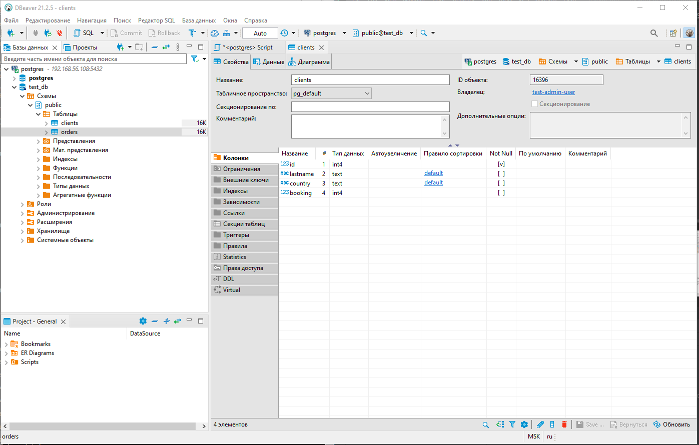

#1

>docker pull postgres:12
> docker images

    REPOSITORY   TAG       IMAGE ID       CREATED      SIZE
    postgres     12        07bb950b6a90   6 days ago   371MB

>mkdir /opt/postgres/backup

>mkdir /opt/postgres/data

>docker run --rm --name pg-docker -e POSTGRES_PASSWORD=postgres -d -p 5432:5432 -v /opt/postgres/data:/var/lib/postgresql/data -v /opt/postgres/backup:/var/lib/postgresql/backup postgres:12 

>docker ps -a
CONTAINER ID   IMAGE         COMMAND                  CREATED          STATUS          PORTS                                       NAMES
ad241be8a845   postgres:12   "docker-entrypoint.s…"   36 seconds ago   Up 36 seconds   0.0.0.0:5432->5432/tcp, :::5432->5432/tcp   pg-docker

#2

>docker exec -it pg-docker /bin/bash

>su postgres

>psql

    postgres=# CREATE DATABASE test_db;
    CREATE DATABASE

    postgres=# SELECT datname FROM pg_database;
      datname
    -----------
     postgres
     template1
     template0
     test_db
    (4 rows)

    postgres=# CREATE USER "test-admin-user" SUPERUSER LOGIN PASSWORD 'test';
    CREATE ROLE

    GRANT ALL PRIVILEGES ON DATABASE "test_db" to "test-admin-user";
    GRANT

    postgres=# CREATE USER "test-simple-user" LOGIN PASSWORD 'test';
    CREATE ROLE

    CREATE TABLE orders 
    (
        id 		integer PRIMARY KEY, 
        name 	text, 
        price 	integer
    );

    CREATE TABLE clients 
    (
        id integer PRIMARY KEY,
        lastname text,
        country text,
        booking integer,
        FOREIGN KEY (booking) REFERENCES orders (Id)
    );
    
    postgres=# GRANT SELECT,INSERT,UPDATE,DELETE ON TABLE public.clients TO "test-simple-user";
 
    postgres=# GRANT SELECT,INSERT,UPDATE,DELETE ON TABLE public.orders TO "test-simple-user";

    select grantor , grantee ,table_catalog ,table_name ,privilege_type 
    from information_schema.table_privileges tp 
    where grantee in ('test-admin-user','test-simple-user');

#3

    insert into orders(id,name,price) VALUES (1,'Шоколад', 10); 
    insert into orders(id,name,price) VALUES (2,'Принтер', 3000);
    insert into orders(id,name,price) VALUES (3,'Книга', 500);
    insert into orders(id,name,price) VALUES (4,'Монитор', 7000);
    insert into orders(id,name,price) VALUES (5,'Гитара', 4000);
    
    commit;
    
    insert into clients VALUES (1, 'Иванов Иван Иванович', 'USA');
    insert into clients VALUES (2, 'Петров Петр Петрович', 'Canada');
    insert into clients VALUES (3, 'Иоганн Себастьян Бах', 'Japan');
    insert into clients VALUES (4, 'Ронни Джеймс Дио', 'Russia');
    insert into clients VALUES (5, 'Ritchie Blackmore', 'Russia');
    
    commit;
    
    select count (*) from orders;
    
    select count (*) from clients;

#4
    
    update clients
    set booking  = 3
    where id = 1;
    
    update clients
    set booking  = 4
    where id = 2;
    
    update clients
    set booking  = 2
    where id = 3;
    
    commit;
    
    select * from clients c 
    where booking is not null

#5

    План этого запроса интереснее рассматривать

    explain select * from clients c 
    join orders o 
    on c.booking = o.id 

    Hash Join  (cost=37.00..57.24 rows=810 width=112)
      Hash Cond: (c.booking = o.id)
      ->  Seq Scan on clients c  (cost=0.00..18.10 rows=810 width=72)
      ->  Hash  (cost=22.00..22.00 rows=1200 width=40)
            ->  Seq Scan on orders o  (cost=0.00..22.00 rows=1200 width=40)

Scan on orders - сканирование таблицы orders
cost=0.00..22.00 - предполагаю, что это оценка стоимости шага.
rows=1200 - предполагаемое количество строк
width=40 - предполагаемая длина строки

Hash - создает хэш/ассоциативный массив/словарь со строками

Seq Scan on clients - сканирование таблицы clients

Hash Cond: (c.booking = o.id) - условие соединения таблиц

Hash Join - соединение таблиц используя Hash таблицу

#6
 
Попробовал использовать pg_basebackup, но не смог разобраться как восстановиться из бекапа.
С дампом все просто и понятно, главное чтобы данные не менялись во время создания.

>pg_dump -U postgres test_db -f /var/lib/postgresql/backup/dump_test.sql

>docker container stop pg-docker
pg-docker

>mkdir /opt/postgres/data2

>docker run --rm --name pg-recover -e POSTGRES_PASSWORD=postgres -d -p 5430:5432 -v /opt/postgres/data2:/var/lib/postgresql/data -v /opt/postgres/backup:/var/lib/postgresql/backup postgres:12
14689ad19eecbff97f389cb82616d1f82c502b2d5b8d9939a81e4fec09191cb5

>docker ps -a
CONTAINER ID   IMAGE         COMMAND                  CREATED         STATUS         PORTS                                       NAMES
52557552ac8d   postgres:12   "docker-entrypoint.s…"   6 seconds ago   Up 6 seconds   0.0.0.0:5430->5432/tcp, :::5430->5432/tcp   pg-recover

>docker exec -it pg-recover /bin/bash

>su postgres

>psql

postgres=# CREATE DATABASE test_db;
CREATE DATABASE
 

postgres=# CREATE USER "test-admin-user" SUPERUSER LOGIN PASSWORD 'test';
postgres=# CREATE USER "test-simple-user" LOGIN PASSWORD 'test';

postgres=# quit

>psql -U postgres -d test_db -f /var/lib/postgresql/backup/dump_test.sql
SET
SET
SET
SET
SET
 set_config
------------

(1 row)

SET
SET
SET
SET
SET
SET
CREATE TABLE
ALTER TABLE
CREATE TABLE
ALTER TABLE
COPY 5
COPY 5
ALTER TABLE
ALTER TABLE
ALTER TABLE
GRANT
GRANT

