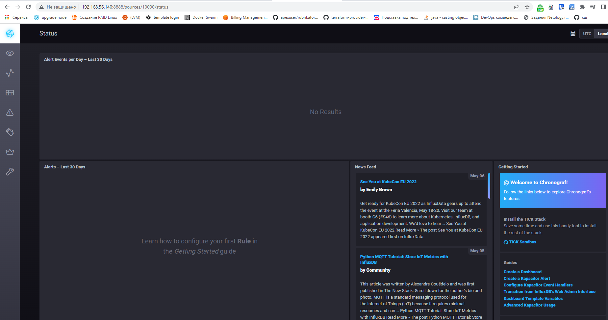
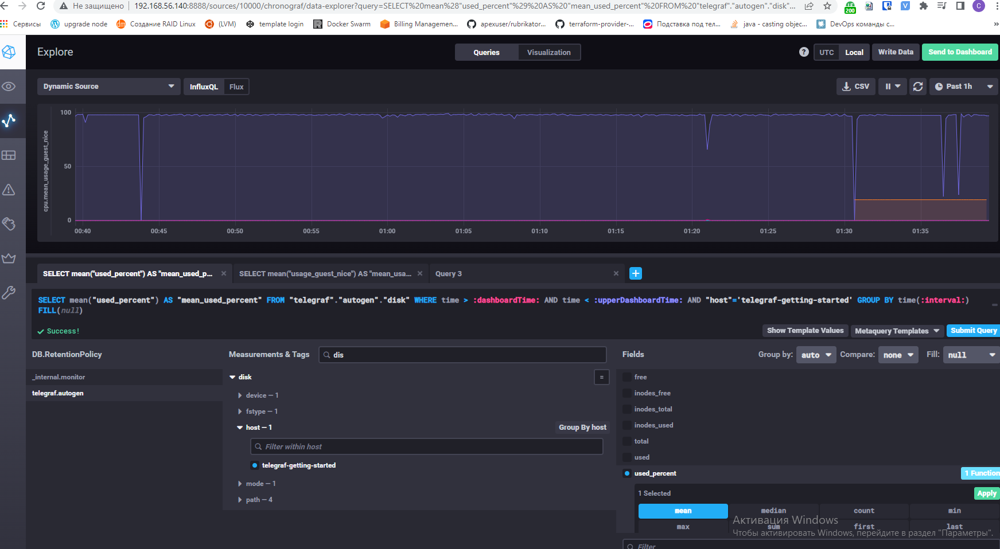
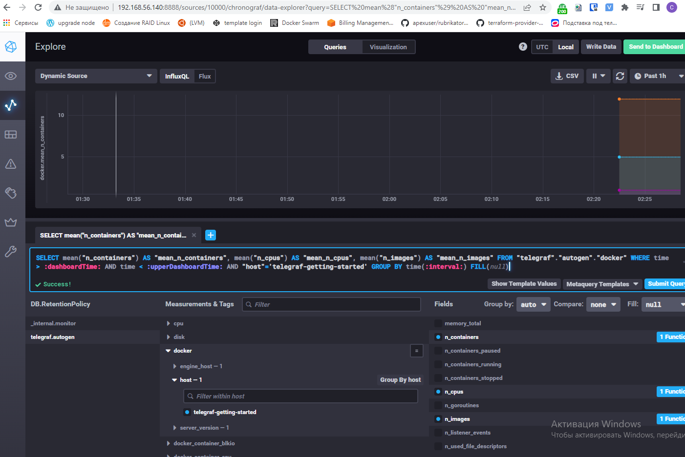
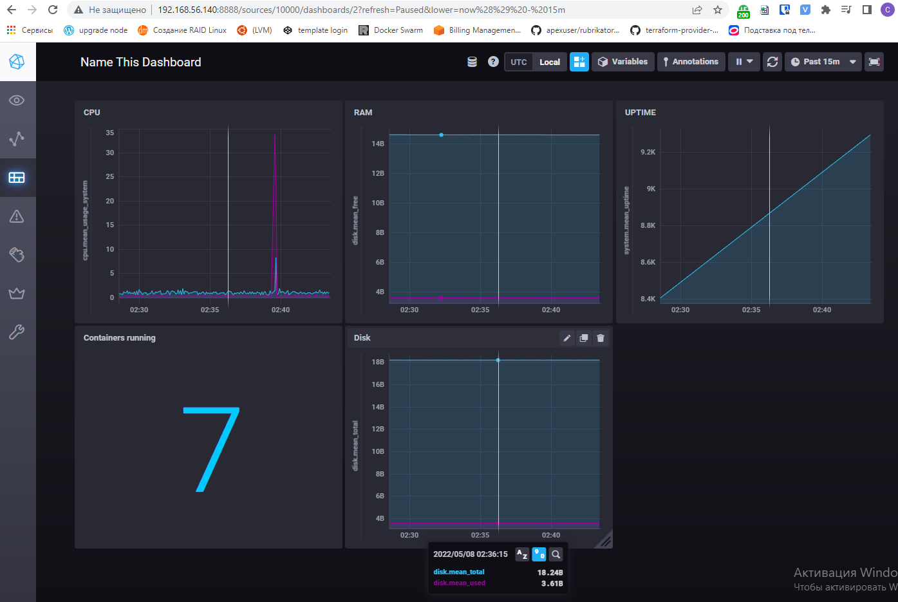

# Обязательные задания

## 1. Опишите основные плюсы и минусы pull и push систем мониторинга.

### Push

#### Плюсы:

- Можно передавать данные в несколько систем мониторингов. 
- Может быть полезно, чтобы отправлять сообщения в разные контуры. 
- Управлять секретами легче, поскольку секреты можно применять в пайплайнах, 
  а также хранить в Git в зашифрованном виде (в зависимости от предпочтений пользователя).
 
### Минусы:

- Агенты могут завалить сервера данными
- Требуется настройка агентов на контролируемом сервере

### Pull

#### Плюсы

- Внешний клиент не имеет прав на внесение изменений в кластер, все обновления накатываются изнутри
- Данные по требуемым метрикам хранятся на сервере, как и периоде получения данных.

### Минусы:

- Неудобство для динамических машин (докер-контейнеры) нужно динамически собирать статистику о наличии машин, нужен дополнительный оркестратор
- Сложность в управлении секретами

## 2. Какие из ниже перечисленных систем относятся к push модели, а какие к pull? А может есть гибридные?

---

| Система | Модель |
| ------ | ------ |
| Prometheus  | Pull ( Есть компонент, в который можно пушить метрики: Push с Pushgateway)|
| TICK | Push |
| Zabbix | Push/Pull |
| VictoriaMetrics | Push/Pull, зависит от источника |
| Nagios | Pull |

## 3. Склонируйте себе репозиторий и запустите TICK-стэк, используя технологии docker и docker-compose.

```
./sandbox up
```

В виде решения на это упражнение приведите выводы команд с вашего компьютера (виртуальной машины):

- curl http://localhost:8086/ping
  
````
curl http://localhost:8086/ping -v
* About to connect() to localhost port 8086 (#0)
*   Trying ::1...
* Connected to localhost (::1) port 8086 (#0)
> GET /ping HTTP/1.1
> User-Agent: curl/7.29.0
> Host: localhost:8086
> Accept: */*
>
< HTTP/1.1 204 No Content
< Content-Type: application/json
< Request-Id: 9d5acae3-ce51-11ec-8167-0242ac170002
< X-Influxdb-Build: OSS
< X-Influxdb-Version: 1.8.10
< X-Request-Id: 9d5acae3-ce51-11ec-8167-0242ac170002
< Date: Sat, 07 May 2022 22:04:06 GMT
<
* Connection #0 to host localhost left intact

````

- curl http://localhost:8888
  
````
curl http://localhost:8888 -v
* About to connect() to localhost port 8888 (#0)
*   Trying ::1...
* Connected to localhost (::1) port 8888 (#0)
> GET / HTTP/1.1
> User-Agent: curl/7.29.0
> Host: localhost:8888
> Accept: */*
>
< HTTP/1.1 200 OK
< Accept-Ranges: bytes
< Cache-Control: public, max-age=3600
< Content-Length: 336
< Content-Security-Policy: script-src 'self'; object-src 'self'
< Content-Type: text/html; charset=utf-8
< Etag: "3362220244"
< Last-Modified: Tue, 22 Mar 2022 20:02:44 GMT
< Vary: Accept-Encoding
< X-Chronograf-Version: 1.9.4
< X-Content-Type-Options: nosniff
< X-Frame-Options: SAMEORIGIN
< X-Xss-Protection: 1; mode=block
< Date: Sat, 07 May 2022 22:06:07 GMT
<
* Connection #0 to host localhost left intact
<!DOCTYPE html><html><head><meta http-equiv="Content-type" content="text/html; charset=utf-8"><title>Chronograf</title><link rel="icon shortcut" href="/favicon.fa749080.ico"><link rel="stylesheet" href="/src.9cea3e4e.css"></head><body> <div id="react-root" data-basepath=""></div> <script src="/src.a969287c.js"></script> </body></html>
````

- curl http://localhost:9092/kapacitor/v1/ping

````
curl http://localhost:9092/kapacitor/v1/ping -v
* About to connect() to localhost port 9092 (#0)
*   Trying ::1...
* Connected to localhost (::1) port 9092 (#0)
> GET /kapacitor/v1/ping HTTP/1.1
> User-Agent: curl/7.29.0
> Host: localhost:9092
> Accept: */*
>
< HTTP/1.1 204 No Content
< Content-Type: application/json; charset=utf-8
< Request-Id: 10915c06-ce52-11ec-81ae-000000000000
< X-Kapacitor-Version: 1.6.4
< Date: Sat, 07 May 2022 22:07:20 GMT
<
* Connection #0 to host localhost left intact
````

А также скриншот веб-интерфейса ПО chronograf (http://localhost:8888).
  


P.S.: если при запуске некоторые контейнеры будут падать с ошибкой - проставьте им режим Z, например ./data:/var/lib:Z

## 4. Перейдите в веб-интерфейс Chronograf (http://localhost:8888) и откройте вкладку Data explorer.
 
Для выполнения задания приведите скриншот с отображением метрик утилизации места на диске (disk->host->telegraf_container_id) из веб-интерфейса.



## 5. Изучите список telegraf inputs. Добавьте в конфигурацию telegraf следующий плагин - docker:
[[inputs.docker]]
  endpoint = "unix:///var/run/docker.sock"
Дополнительно вам может потребоваться донастройка контейнера telegraf в docker-compose.yml дополнительного volume и режима privileged:

  telegraf:
    image: telegraf:1.4.0
    privileged: true
    volumes:
      - ./etc/telegraf.conf:/etc/telegraf/telegraf.conf:Z
      - /var/run/docker.sock:/var/run/docker.sock:Z
    links:
      - influxdb
    ports:
      - "8092:8092/udp"
      - "8094:8094"
      - "8125:8125/udp"
После настройке перезапустите telegraf, обновите веб интерфейс и приведите скриншотом список measurments в веб-интерфейсе базы telegraf.autogen . Там должны появиться метрики, связанные с docker.



# Дополнительное задание (со звездочкой*) - необязательно к выполнению

В веб-интерфейсе откройте вкладку Dashboards. Попробуйте создать свой dashboard с отображением:

- утилизации ЦПУ
- количества использованного RAM
- утилизации пространства на дисках
- количество поднятых контейнеров
- аптайм
- ...
- фантазируйте)

