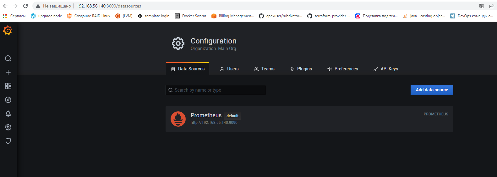
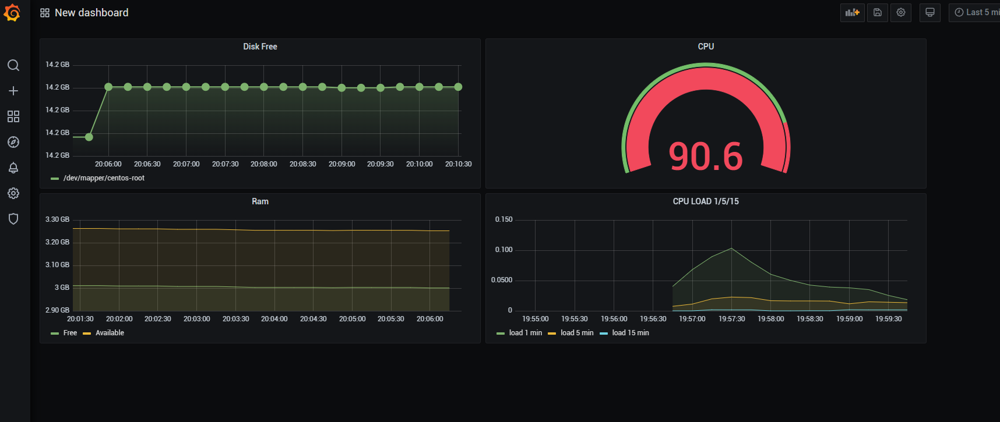
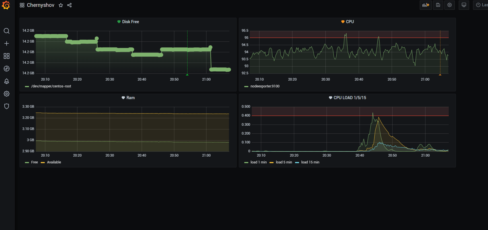

# Обязательные задания

## Задание 1

Используя директорию help внутри данного домашнего задания - запустите связку prometheus-grafana.

````
docker-compose up
````

Решение домашнего задания - скриншот веб-интерфейса grafana со списком подключенных Datasource.



## Задание 2 

Создайте Dashboard и в ней создайте следующие Panels:

- Утилизация CPU для nodeexporter (в процентах, 100-idle)

````
avg by (instance) (rate(node_cpu_seconds_total{job="nodeexporter",mode="idle"}[$__rate_interval])) * 100
````

- CPULA 1/5/15

````
avg by (instance)(rate(node_load1{}[$__rate_interval]))
````
````
avg by (instance)(rate(node_load5{}[$__rate_interval]))
````
````
avg by (instance)(rate(node_load15{}[$__rate_interval]))
````

- Количество свободной оперативной памяти

````
avg(node_memory_MemFree_bytes{instance="nodeexporter:9100",job="nodeexporter"})
````
````
avg(node_memory_MemAvailable_bytes{instance="nodeexporter:9100", job="nodeexporter"})
````

- Количество места на файловой системе

````
node_filesystem_free_bytes{fstype="xfs",instance="nodeexporter:9100",job="nodeexporter",device="/dev/mapper/centos-root"}
````
 


Задание 3
Создайте для каждой Dashboard подходящее правило alert (можно обратиться к первой лекции в блоке "Мониторинг").



Задание 4
Сохраните ваш Dashboard.

["Файл Model"](json.model)