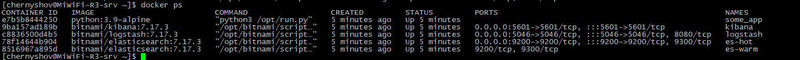
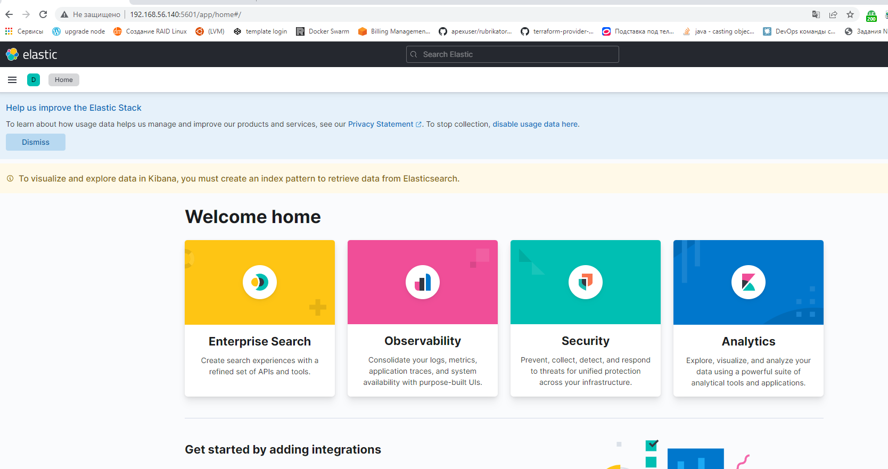
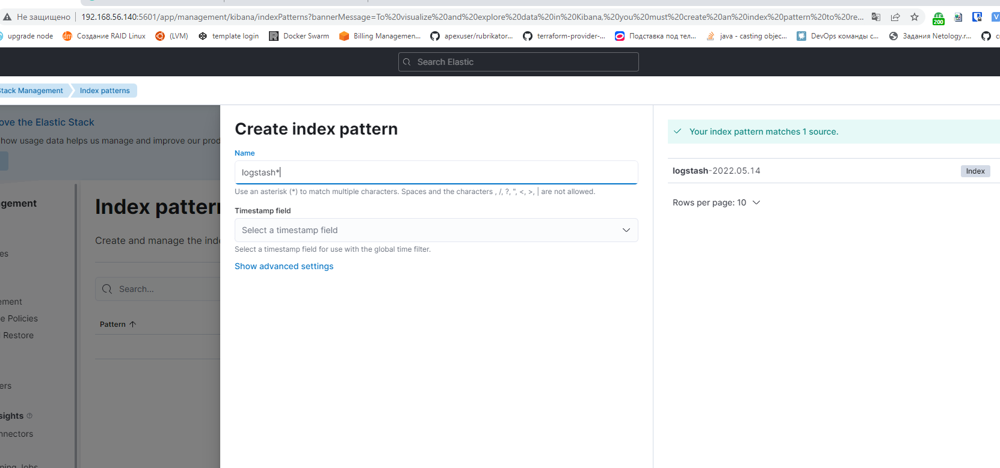
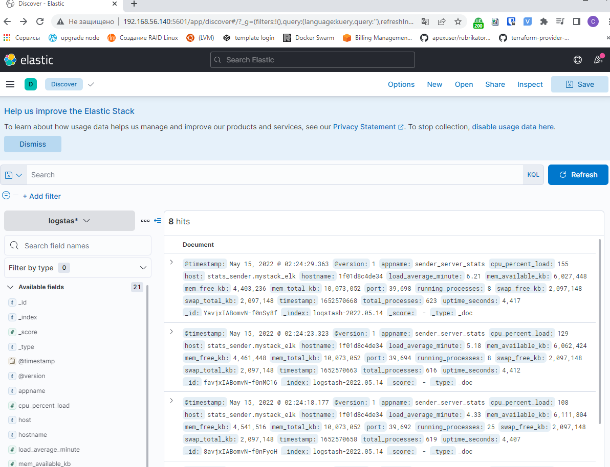

# Задание 1

Поднял в докере:

elasticsearch(hot и warm ноды)
logstash
kibana
filebeat
и связать их между собой.

Logstash следует сконфигурировать для приёма по tcp json сообщений.

Filebeat следует сконфигурировать для отправки логов docker вашей системы в logstash.

Использовал директорию help. 
Изменил образы в docker-compose.yml на доступные из нашей страны и поправил ошибки.

Cкриншот docker ps через 5 минут после старта всех контейнеров (их должно быть 5)

Cкриншот интерфейса kibana

# Задание 2

Перейдите в меню создания index-patterns в kibana и создайте несколько index-patterns из имеющихся.

Перейдите в меню просмотра логов в kibana (Discover) и самостоятельно изучите как отображаются логи и как производить поиск по логам.

