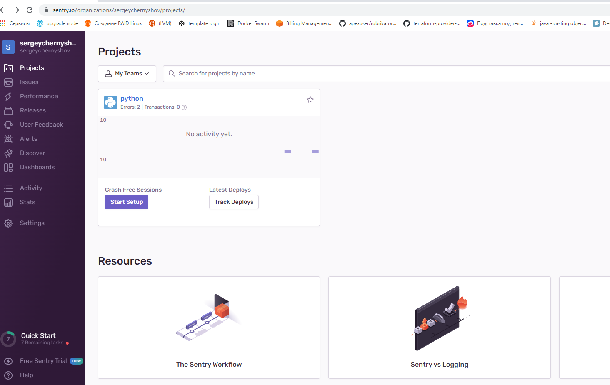
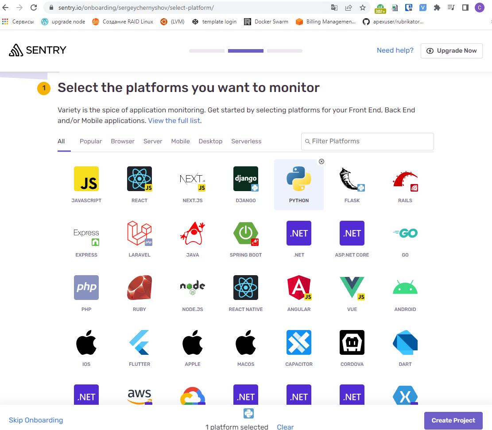
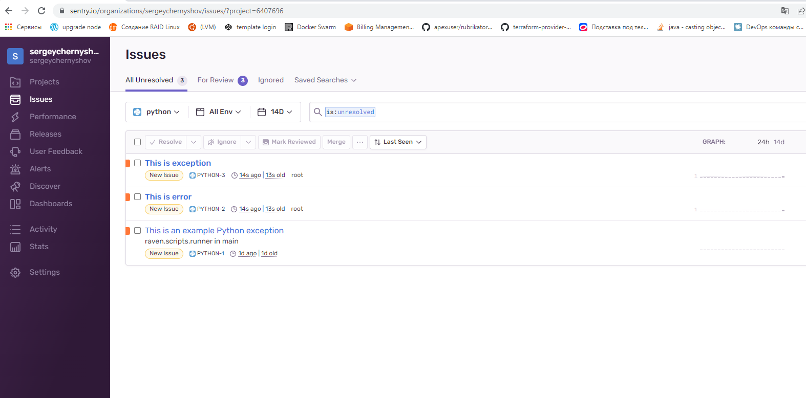
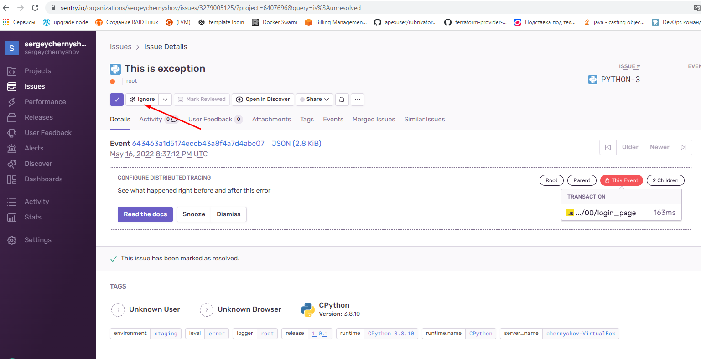
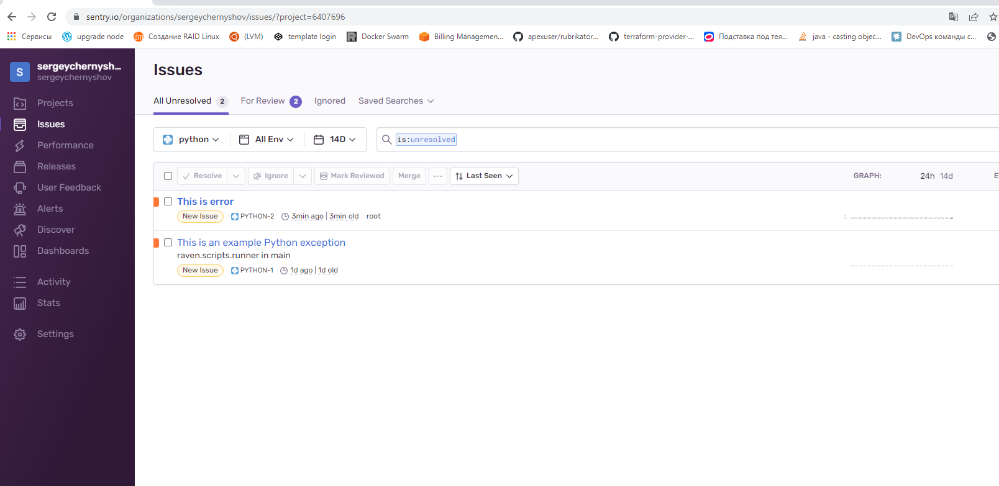
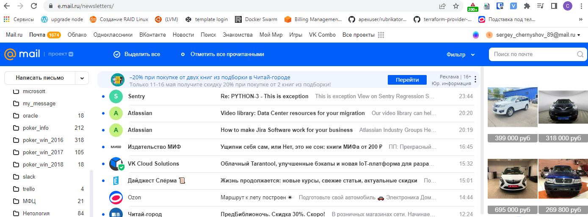
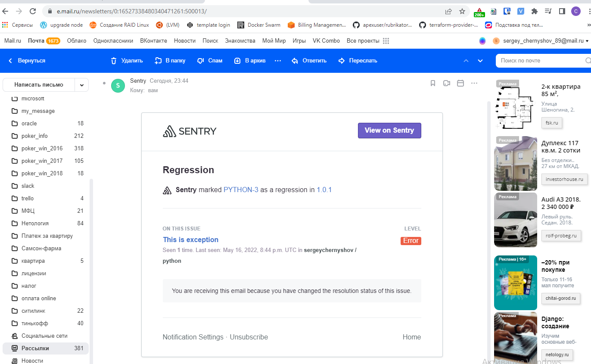

# Задание 1

Для выполнения задания - пришлите скриншот меню Projects.





# Задание 2

Для выполнения задание предоставьте скриншот Stack trace из этого события и список событий проекта, после нажатия Resolved.








# Задание 3

Для выполнения задания - пришлите скриншот тела сообщения из оповещения на почте.






Prepare the Python SDK

Install our Python SDK using pip:

pip install --upgrade sentry-sdk
Import and initialize the Sentry SDK early in your application's setup:

import sentry_sdk
sentry_sdk.init(
    "https://943a7c1eb98a4034b7ac50b481ec62e2@o1247685.ingest.sentry.io/6407696",

    # Set traces_sample_rate to 1.0 to capture 100%
    # of transactions for performance monitoring.
    # We recommend adjusting this value in production.
    traces_sample_rate=1.0
)
The above configuration captures both error and performance data. To reduce the volume of performance data captured, change traces_sample_rate to a value between 0 and 1.

One way to verify your setup is by intentionally causing an error that breaks your application.

Raise an unhandled Python exception by inserting a divide by zero expression into your application:

division_by_zero = 1 / 0


```
pip install --upgrade sentry-sdk
Collecting sentry-sdk
  Downloading sentry_sdk-1.5.12-py2.py3-none-any.whl (145 kB)
     |████████████████████████████████| 145 kB 1.4 MB/s
Requirement already satisfied, skipping upgrade: urllib3>=1.10.0 in /usr/lib/python3/dist-packages (from sentry-sdk) (1.25.8)
Requirement already satisfied, skipping upgrade: certifi in /usr/lib/python3/dist-packages (from sentry-sdk) (2019.11.28)
Installing collected packages: sentry-sdk
Successfully installed sentry-sdk-1.5.12

```