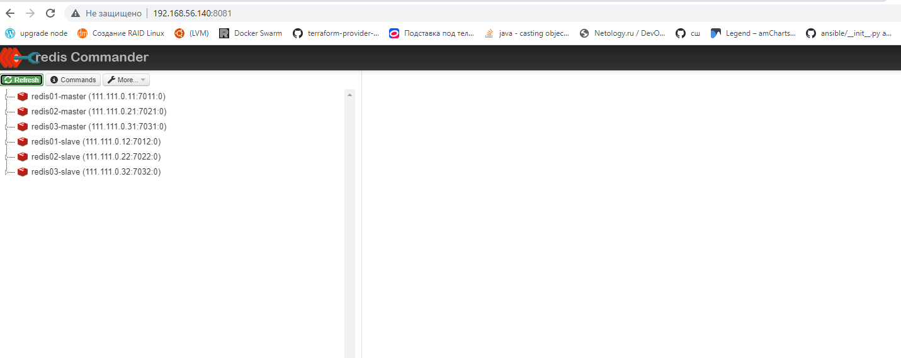

Задача 1: Кластеризация
Предложите решение для обеспечения развертывания, запуска и управления приложениями. Решение может состоять из одного или нескольких программных продуктов и должно описывать способы и принципы их взаимодействия.

Решение должно соответствовать следующим требованиям:

Поддержка контейнеров;
Обеспечивать обнаружение сервисов и маршрутизацию запросов;
Обеспечивать возможность горизонтального масштабирования;
Обеспечивать возможность автоматического масштабирования;
Обеспечивать явное разделение ресурсов доступных извне и внутри системы;
Обеспечивать возможность конфигурировать приложения с помощью переменных среды, в том числе с возможностью безопасного хранения чувствительных данных таких как пароли, ключи доступа, ключи шифрования и т.п.
Обоснуйте свой выбор.

Источники информации 
* [ссылка 1](https://wiki.merionet.ru/servernye-resheniya/66/14-instrumentov-orkestracii-kontejnerov-dlya-devops/)
* [ссылка 2](https://mcs.mail.ru/blog/sravnenie-kubernetes-s-drugimi-resheniyami)

<table>
<tr>
<th>Критерий</th>
<th>Docker Swarm</th> 
<th>Kubernetes</th>
<th>Apache Mesos</th>
<th>Nomad</th>
<th>OpenShift</th>
</tr>

<tr>
<td>Поддержка контейнеров</td>
<td align="center">+</td>
<td align="center">+</td>
<td align="center">+</td>
<td align="center">+</td>
<td align="center">+</td>
</tr>

<tr>
<td>обнаружение сервисов</td>
<td align="center">+</td>
<td align="center">+</td>
<td align="center">+</td>
<td align="center">-</td>
<td align="center">+-</td>
</tr>

<tr>
<td>маршрутизация запросов</td>
<td align="center">+</td>
<td align="center">+</td>
<td align="center">+</td>
<td align="center">+</td>
<td align="center">+</td>
</tr>

<tr>
<td>горизонтальное масштабирования</td>
<td align="center">+</td> 
<td align="center">+</td> 
<td align="center"></td> 
<td align="center">+</td> 
<td align="center">+</td> 
</tr>

<tr>
<td>автоматическое масштабирования</td>
<td align="center">-</td>
<td align="center">+</td>
<td align="center">-</td>
<td align="center">+</td> 
<td align="center">+</td> 
</tr>

<tr>
<td>разделение ресурсов</td>
<td align="center">-</td>
<td align="center">+</td>
<td align="center">+</td>
<td align="center">-</td>
<td align="center">-</td>
</tr>

<tr>
<td>возможность конфигурировать приложения с помощью переменных среды</td>
<td align="center">+</td>
<td align="center">+</td>
<td align="center">-</td>
<td align="center">+</td>
<td align="center">+</td>
</tr>
</table>

Выбор итогового решения зависит от условий, в рамках которых будет использоваться конечная система.
Docker Swarm самое простое решение для поддержки нескольких контейнеров.
OpenShift прост в эксплуатации и хорошо походит для средней компании.
Kubernetes отлично походит для крупных проектов, т.к. это решение требует
специфических навыков по администрированию и управлению.

Задача 2: Распределенный кэш * (необязательная)
Разработчикам вашей компании понадобился распределенный кэш для организации хранения временной информации по сессиям пользователей. Вам необходимо построить Redis Cluster состоящий из трех шард с тремя репликами.


Разворачивал кластер в Docker-compose

Поправил пакет
````
pip3 uninstall -y cryptography
pip3 install cryptography==36.0.2
````
Запущенный кластер


Файл для разворота кластера
[docker-compose.yaml](redis-cluster/docker-compose.yaml)