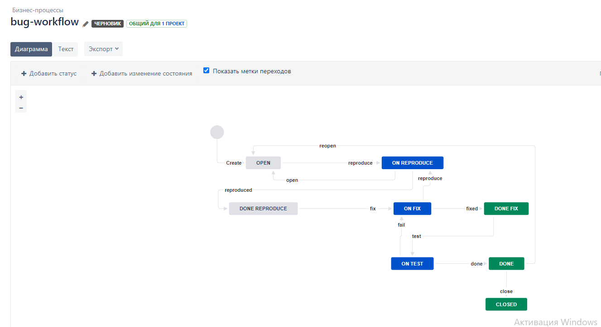
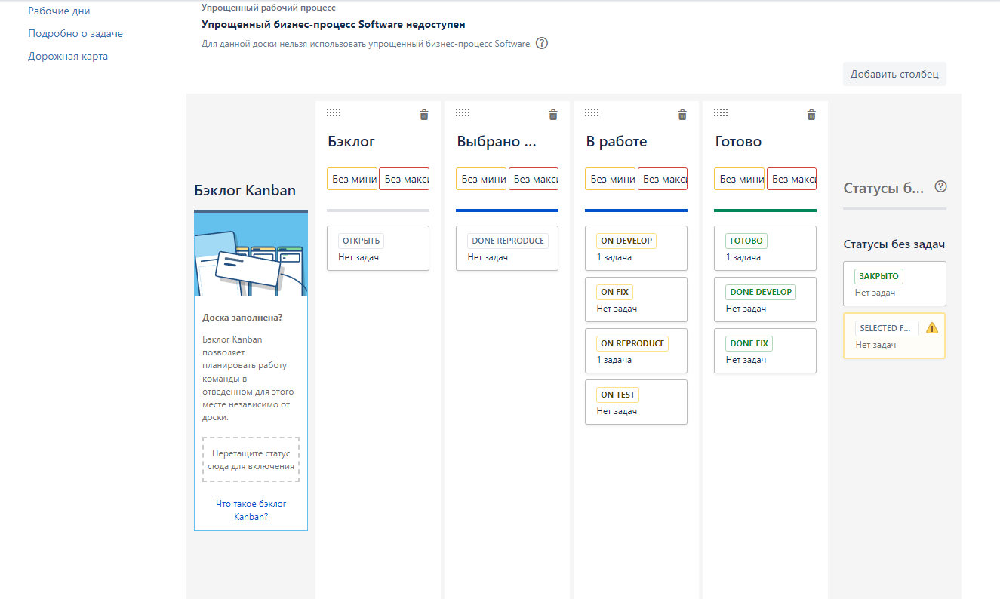
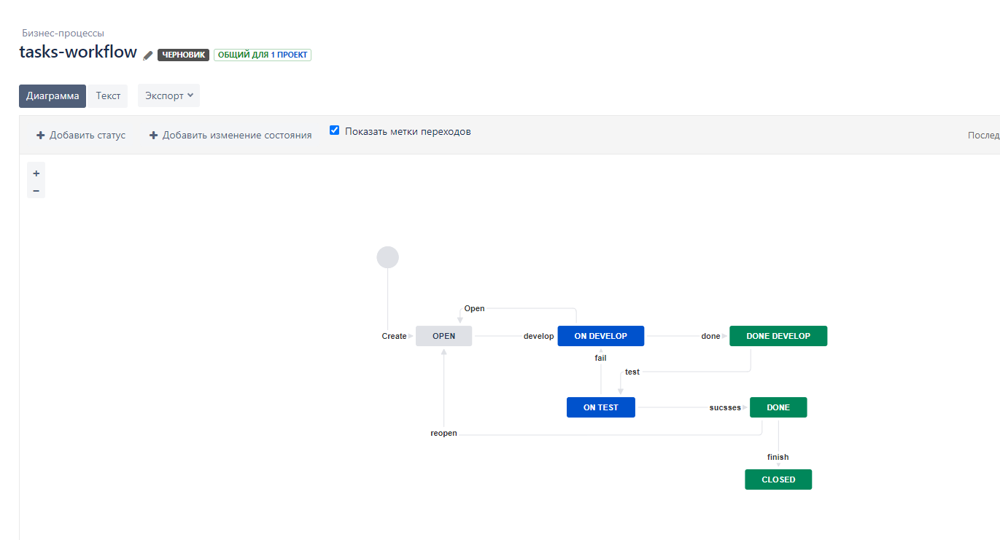
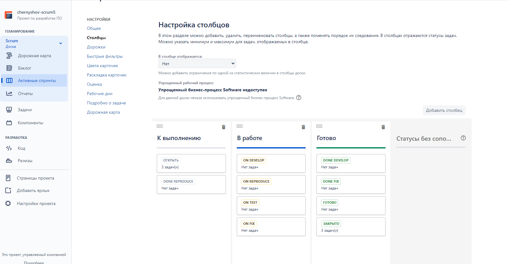

# Подготовка к выполнению

Выполнена

# Основная часть

bug workflow

1. Open -> On reproduce
2. On reproduce <-> Open, Done reproduce
3. Done reproduce -> On fix
4. On fix <-> On reproduce, Done fix
5. Done fix -> On test
6. On test <-> On fix, Done
7. Done <-> Closed, Open

Создать задачу с типом bug, попытаться провести его по всему workflow до Done. 
Создать задачу с типом epic, к ней привязать несколько задач с типом task, провести их по всему workflow до Done. 
При проведении обеих задач по статусам использовать kanban. Вернуть задачи в статус Open.

tasks workflow

1. Open -> On develop
2. On develop <-> Open, Done develop
3. Done develop -> On test
4. On test <-> On develop, Done
5. Done <-> Closed, Open

Перейти в scrum, запланировать новый спринт, состоящий из задач эпика и одного бага, 
стартовать спринт, провести задачи до состояния Closed. Закрыть спринт.

# Файлы с workflow

- [Bug workflow XML](.https://github.com/sergeychernyshov/devops-netology/blob/main/soft/hw9.1/bug-workflow.xml "Bug workflow XML")
- [Tasks workflow XML](https://github.com/sergeychernyshov/devops-netology/blob/main/soft/hw9.1/tasks-workflow.xml "Tasks workflow XML")