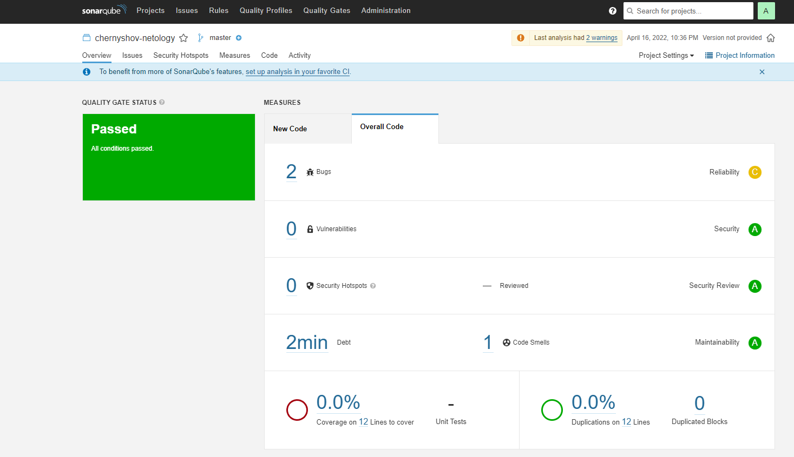
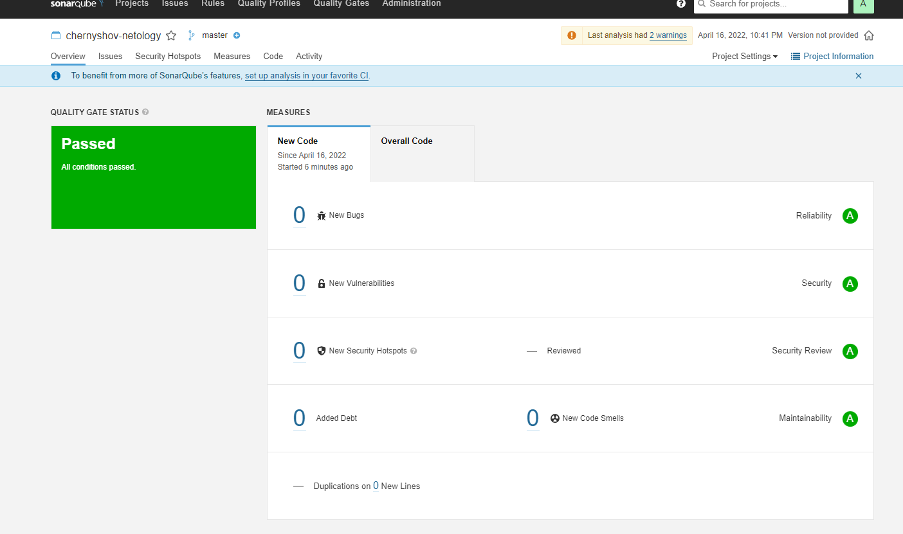
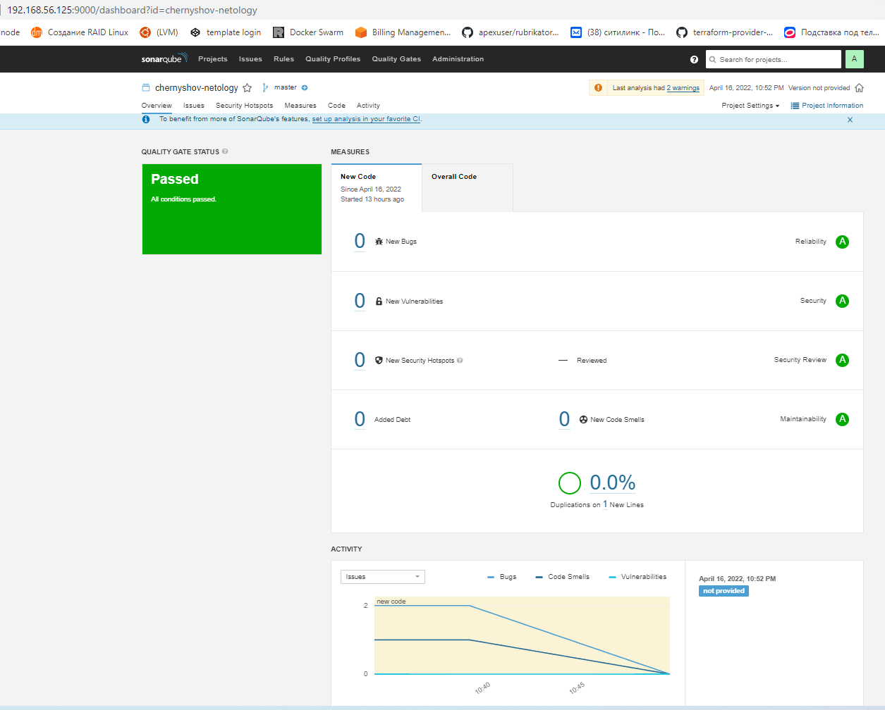
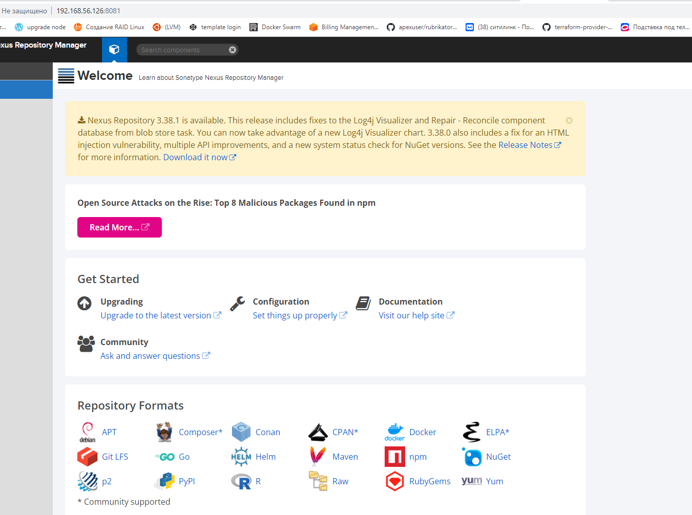
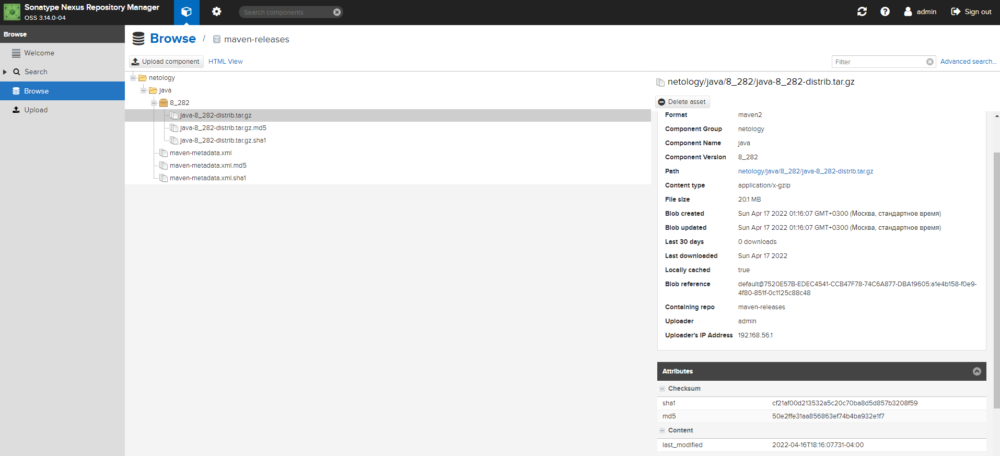
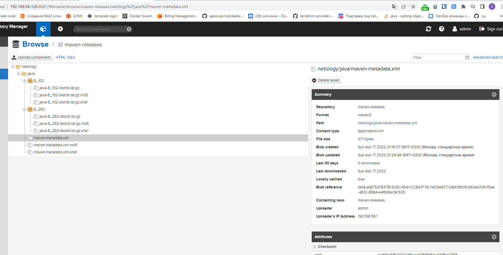
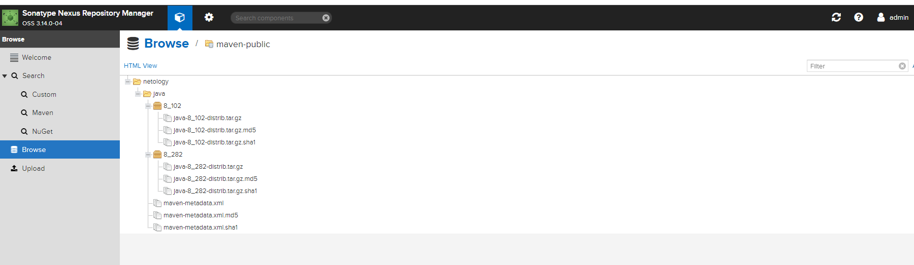
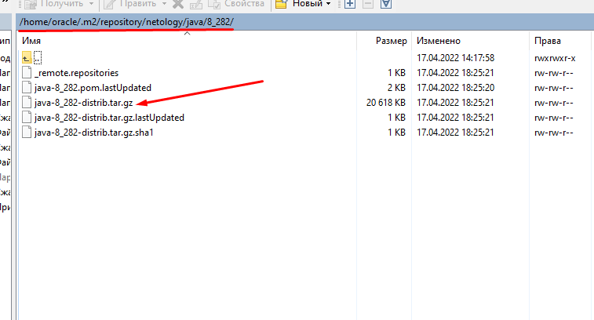

# Подготовка серверов

>ssh-copy-id chernyshov@192.168.56.125 

>ssh-copy-id chernyshov@192.168.56.126
 

>echo "chernyshov  ALL=(ALL) NOPASSWD:ALL" | sudo tee /etc/sudoers.d/chernyshov

>echo "chernyshov  ALL=(ALL) NOPASSWD:ALL" | sudo tee /etc/sudoers.d/chernyshov

>ansible-playbook site.yml -i inventory/cicd/

http://192.168.56.125:9000/
http://192.168.56.126:8081/

# Знакомоство с SonarQube
## Основная часть

1. Создаём новый проект, название произвольное

Создал проект  **chernyshov-netology** 

токен cf19b0f5e088a1b432f591fa9820bafccdc47aff

2. Скачиваем пакет sonar-scanner, который нам предлагает скачать сам sonarqube
   
Скачал файлы, дал права на исполнение

3. Делаем так, чтобы binary был доступен через вызов в shell (или меняем переменную PATH или любой другой удобный вам способ)
   
добавил в PATH
export PATH=$PATH:$(pwd)

>echo $PATH

    /home/oracle/.local/bin:/usr/local/sbin:/usr/local/bin:/usr/sbin:/usr/bin:/sbin:/bin:/usr/games:/usr/local/games:
    /snap/bin:/home/oracle/sonar/bin

4. Проверяем sonar-scanner --version

>sonar-scanner --version

    INFO: Scanner configuration file: /home/oracle/sonar/conf/sonar-scanner.properties
    INFO: Project root configuration file: NONE
    INFO: SonarScanner 4.7.0.2747
    INFO: Java 11.0.14.1 Eclipse Adoptium (64-bit)
    INFO: Linux 5.13.0-39-generic amd64

5. Запускаем анализатор против кода из директории example с дополнительным ключом -Dsonar.coverage.exclusions=fail.py

>sonar-scanner   -Dsonar.projectKey=chernyshov-netology   -Dsonar.sources=.   -Dsonar.host.url=http://192.168.56.125:9000   -Dsonar.login=cf19b0f5e088a1b432f591fa9820bafccdc47aff   

>sonar-scanner   -Dsonar.projectKey=chernyshov-netology   -Dsonar.sources=.   -Dsonar.host.url=http://192.168.56.125:9000   -Dsonar.login=cf19b0f5e088a1b432f591fa9820bafccdc47aff -Dsonar.coverage.exclusions=fail.py

6. Смотрим результат в интерфейсе

Первый запуск

Второй запуск

7. Исправляем ошибки, которые он выявил(включая warnings)

Исправил ошибки   

8. Запускаем анализатор повторно - проверяем, что QG пройдены успешно

>sonar-scanner   -Dsonar.projectKey=chernyshov-netology   -Dsonar.sources=.   -Dsonar.host.url=http://192.168.56.125:9000   -Dsonar.login=cf19b0f5e088a1b432f591fa9820bafccdc47aff -Dsonar.coverage.exclusions=fail.py

9. Делаем скриншот успешного прохождения анализа, прикладываем к решению ДЗ

Успешно выполнилась проверка кода

# Знакомство с Nexus

Запустил Nexus

## Основная часть

1. В репозиторий maven-public загружаем артефакт с GAV параметрами:
  i. groupId: netology
  ii. artifactId: java
  iii. version: 8_282
  iv. classifier: distrib
  v. type: tar.gz

Выполнено

2. В него же загружаем такой же артефакт, но с version: 8_102
   
Выполнено

3. Проверяем, что все файлы загрузились успешно
   
Файлы загрузились в maven-public

4. В ответе присылаем файл maven-metadata.xml для этого артефекта

["maven-metadata.xml"](maven-metadata.xml)

    <metadata modelVersion="1.1.0">
    <groupId>netology</groupId>
    <artifactId>java</artifactId>
    <versioning>
    <latest>8_282</latest>
    <release>8_282</release>
    <versions>
    <version>8_102</version>
    <version>8_282</version>
    </versions>
    <lastUpdated>20220416222948</lastUpdated>
    </versioning>
    </metadata>

## Знакомство с Maven

### Подготовка к выполнению
1. Скачиваем дистрибутив с maven

Скачал версию 3.8.5

2. Разархивируем, делаем так, чтобы binary был доступен через вызов в shell (или меняем переменную PATH или любой другой удобный вам способ)

>export PATH=$PATH:$(pwd)
>echo $PATH

    /home/oracle/.local/bin:/usr/local/sbin:/usr/local/bin:/usr/sbin:/usr/bin:/sbin:/bin:/usr/games:/usr/local/games:/snap/bin:/home/oracle/sonar/bin:$JAVA_HOME/bin:/home/oracle/apache-maven-3.8.5/bin

3. Удаляем из apache-maven-<version>/conf/settings.xml упоминание о правиле, отвергающем http соединение( раздел mirrors->id: my-repository-http-unblocker)

4. Проверяем mvn --version

>mvn --version

    Apache Maven 3.8.5 (3599d3414f046de2324203b78ddcf9b5e4388aa0)
    Maven home: /home/oracle/apache-maven-3.8.5
    Java version: 11.0.14.1, vendor: Ubuntu, runtime: /usr/lib/jvm/java-11-openjdk-amd64
    Default locale: en_US, platform encoding: UTF-8
    OS name: "linux", version: "5.13.0-39-generic", arch: "amd64", family: "unix"
   
5. Забираем директорию mvn с pom

Изменил url в pom.xml на
http://192.168.56.126:8081/repository/maven-public/

### Основная часть
1. Меняем в pom.xml блок с зависимостями под наш артефакт из первого пункта задания для Nexus (java с версией 8_282)

Изменения сделал

["pom.xml"](pom.xml)

    <project xmlns="http://maven.apache.org/POM/4.0.0" xmlns:xsi="http://www.w3.org/2001/XMLSchema-instance"
      xsi:schemaLocation="http://maven.apache.org/POM/4.0.0 http://maven.apache.org/xsd/maven-4.0.0.xsd">
      <modelVersion>4.0.0</modelVersion>
     
      <groupId>com.netology.app</groupId>
      <artifactId>simple-app</artifactId>
      <version>1.0-SNAPSHOT</version>
       <repositories>
        <repository>
          <id>my-repo</id>
          <name>maven-public</name>
          <url>http://192.168.56.126:8081/repository/maven-public/</url>
        </repository>
      </repositories>
      <dependencies>
        <dependency>
          <groupId>netology</groupId>
          <artifactId>java</artifactId>
          <version>8_282</version>
          <classifier>distrib</classifier>
          <type>tar.gz</type>
        </dependency>
      </dependencies>
    </project>

2. Запускаем команду mvn package в директории с pom.xml, ожидаем успешного окончания

>mvn package
    
    [INFO] --------------------------------[ jar ]---------------------------------
    Downloading from my-repo: http://192.168.56.126:8081/repository/maven-public/netology/java/8_282/java-8_282.pom
    [WARNING] The POM for netology:java:tar.gz:distrib:8_282 is missing, no dependency information available
    Downloading from my-repo: http://192.168.56.126:8081/repository/maven-public/netology/java/8_282/java-8_282-distrib.tar.gz
    Downloaded from my-repo: http://192.168.56.126:8081/repository/maven-public/netology/java/8_282/java-8_282-distrib.tar.gz (21 MB at 33 MB/s)
    [INFO]

    .....................
    [INFO] Building jar: /home/oracle/ansible/playbook_hw9.3/mvn/target/simple-app-1.0-SNAPSHOT.jar
    [INFO] ------------------------------------------------------------------------
    [INFO] BUILD SUCCESS
    [INFO] ------------------------------------------------------------------------
    [INFO] Total time:  20.290 s
    [INFO] Finished at: 2022-04-17T18:25:39+03:00

3. Проверяем директорию ~/.m2/repository/, находим наш артефакт

Артефакт найден в каталоге ~/.m2/repository/
   

4. В ответе присылаем исправленный файл pom.xml

["pom.xml"](pom.xml)

    <project xmlns="http://maven.apache.org/POM/4.0.0" xmlns:xsi="http://www.w3.org/2001/XMLSchema-instance"
      xsi:schemaLocation="http://maven.apache.org/POM/4.0.0 http://maven.apache.org/xsd/maven-4.0.0.xsd">
      <modelVersion>4.0.0</modelVersion>
     
      <groupId>com.netology.app</groupId>
      <artifactId>simple-app</artifactId>
      <version>1.0-SNAPSHOT</version>
       <repositories>
        <repository>
          <id>my-repo</id>
          <name>maven-public</name>
          <url>http://192.168.56.126:8081/repository/maven-public/</url>
        </repository>
      </repositories>
      <dependencies>
        <dependency>
          <groupId>netology</groupId>
          <artifactId>java</artifactId>
          <version>8_282</version>
          <classifier>distrib</classifier>
          <type>tar.gz</type>
        </dependency>
      </dependencies>
    </project>