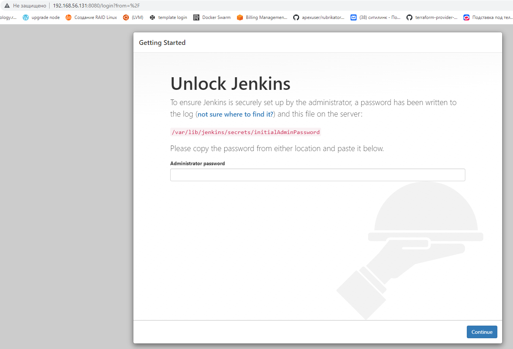
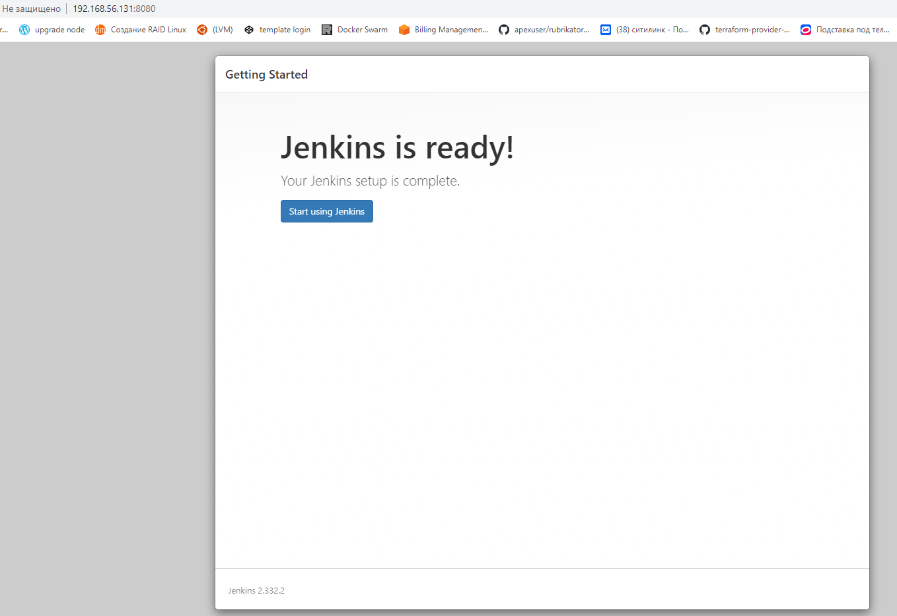
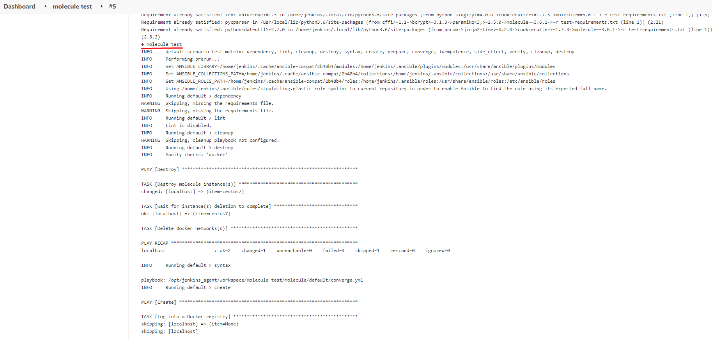
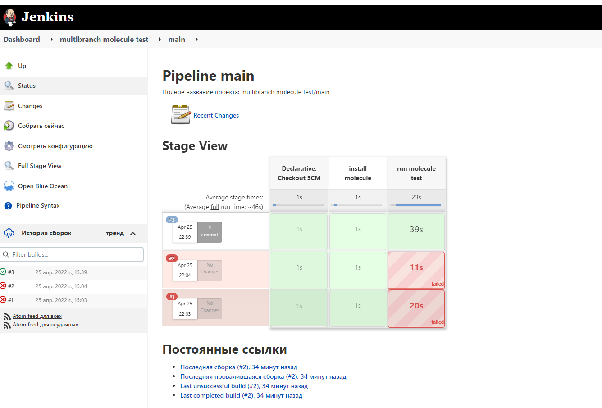

#Подготовка к выполнению

Пробрасываю ключи, чтобы по SSH можно было подключиться без пароля.

При помощи команды отправляю ключ на удаленные сервер к которому буду подключаться c ansible control.

master

    >ssh-copy-id chernyshov@192.168.56.131

agent

    >ssh-copy-id chernyshov@192.168.56.130 

Раздаю возможность делать SUDO без пароля на хостах 192.168.56.128 и 192.168.56.129

    echo "chernyshov  ALL=(ALL) NOPASSWD:ALL" | sudo tee /etc/sudoers.d/chernyshov

Запускаю playbook

    >ansible-playbook site.yml -i inventory/cicd/

После нескольких попыток запуска и исправление ошибок

    PLAY RECAP ************************************************************************************************************
    jenkins-agent-01           : ok=17   changed=3    unreachable=0    failed=0    skipped=0    rescued=0    ignored=0
    jenkins-master-01          : ok=10   changed=0    unreachable=0    failed=0    skipped=1    rescued=0    ignored=0

#Основная часть

1. Сделать Freestyle Job, который будет запускать molecule test из любого вашего репозитория с ролью.

molecule test запущен

2. Сделать Declarative Pipeline Job, который будет запускать molecule test из любого вашего репозитория с ролью.

Запустил Declarative Pipeline Job

3. Перенести Declarative Pipeline в репозиторий в файл Jenkinsfile.

Перенес и добавил ссылку в пункт 8

4. Создать Multibranch Pipeline на запуск Jenkinsfile из репозитория.

Создал Multibranch Pipeline Log

5. Создать Scripted Pipeline, наполнить его скриптом из pipeline.

Это делать не нужно..

6. Внести необходимые изменения, чтобы Pipeline запускал ansible-playbook без флагов --check --diff, если не установлен параметр при запуске джобы (prod_run = True), по умолчанию параметр имеет значение False и запускает прогон с флагами --check --diff.

Составил Pipeline

node('ansible'){
    stage('Checkout') {
        git branch: 'main', credentialsId: 'edbe325c-d85b-40c0-ba03-7254dc08a2a8', url: 'git@github.com:sergeychernyshov/elk-role.git'
    }
    stage('install requirements roles') {
        sh 'pip3 install -r requirements.txt'
        sh 'ansible-galaxy install --roles-path ./roles/ -r requirements.yml'
    }
    stage('run playbook'){
        if ( "${prod_run}" == "true" ){
            sh 'ansible-playbook -i  inventory/prod.yml site.yml'
        }
        else{
            sh 'ansible-playbook -i  inventory/prod.yml site.yml --check --diff'
        }
        cleanWs()
    }
}

7. Проверить работоспособность, исправить ошибки, исправленный Pipeline вложить в репозиторий в файл ScriptedJenkinsfile. Цель: получить собранный стек ELK в Ya.Cloud.

Сохранил файл ScriptedJenkinsfile в репозитории https://github.com/sergeychernyshov/elk-role 

8. Отправить две ссылки на репозитории в ответе: 
   с ролью ["Declarative Pipeline"](https://github.com/sergeychernyshov/elastic-role)

и c плейбукой и ["Scripted Pipeline"](https://github.com/sergeychernyshov/elk-role).

