#Подготовка к выполнению

1. В Ya.Cloud создайте новый инстанс (4CPU4RAM) на основе образа jetbrains/teamcity-server

Первый запуск Teamcity
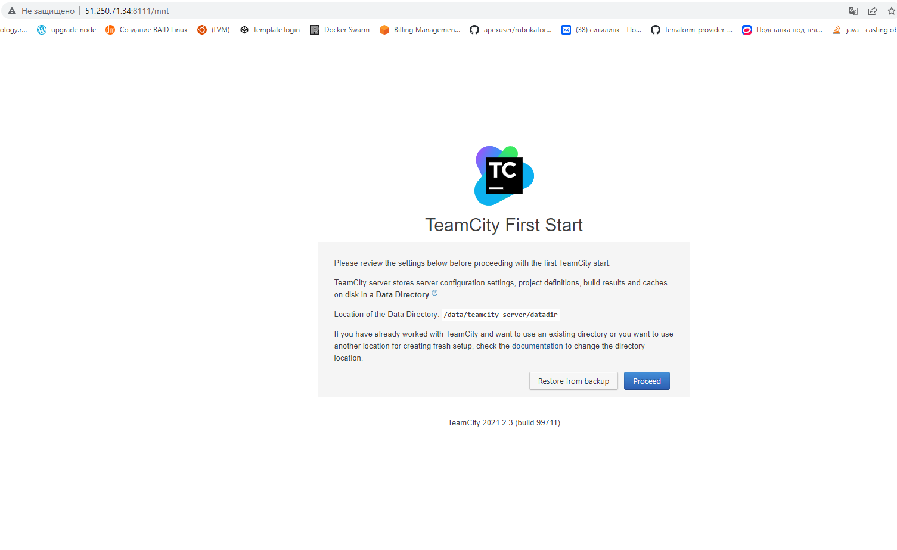

2. Дождитесь запуска Teamcity, выполните первоначальную настройку

Настройка выполнена, стартовая страница Teamcity
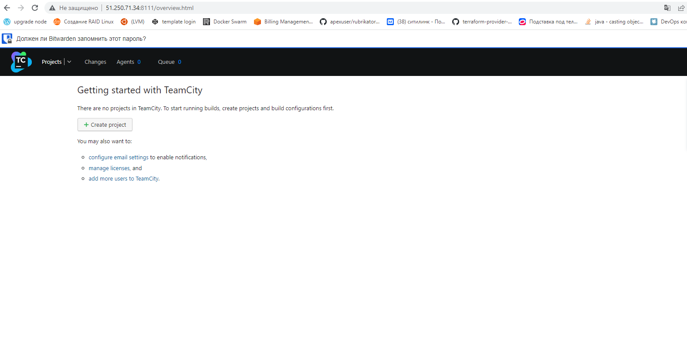

3. Создайте ещё один инстанс(2CPU4RAM) на основе образа jetbrains/teamcity-agent. Пропишите к нему переменную окружения SERVER_URL: "http://<teamcity_url>:8111"

VM для агента Teamcity создана, VM для сервера Teamcity создана
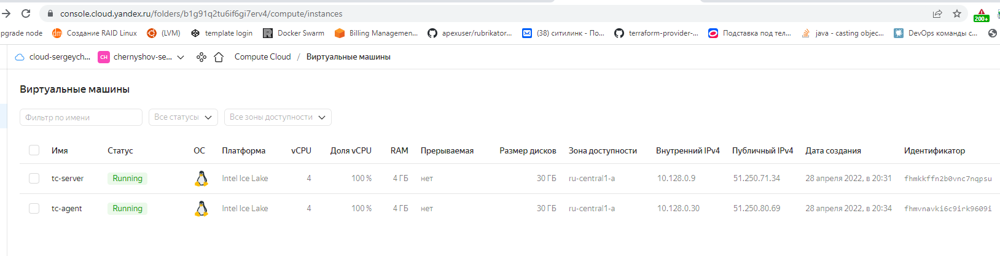

4. Авторизуйте агент

Агент авторизован на сервере Teamcity
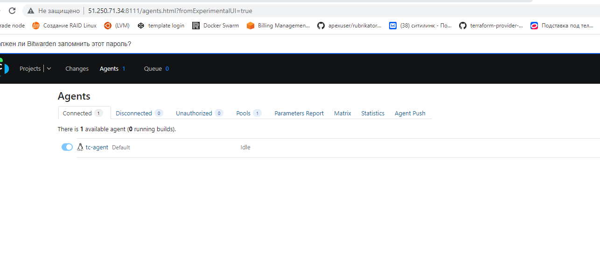

5. Сделайте fork репозитория

Сделал fork репозитория
[сcылка на мой репозиторий](https://github.com/sergeychernyshov/example-teamcity)
   
6. Создать VM (2CPU4RAM) и запустить playbook

>ansible-playbook site.yml -i inventory/cicd

    PLAY RECAP *****************************************************************************************************
    nexus-01                   : ok=17   changed=15   unreachable=0    failed=0    skipped=2    rescued=0    ignored=0

Playbook выполнен Nexus поднят
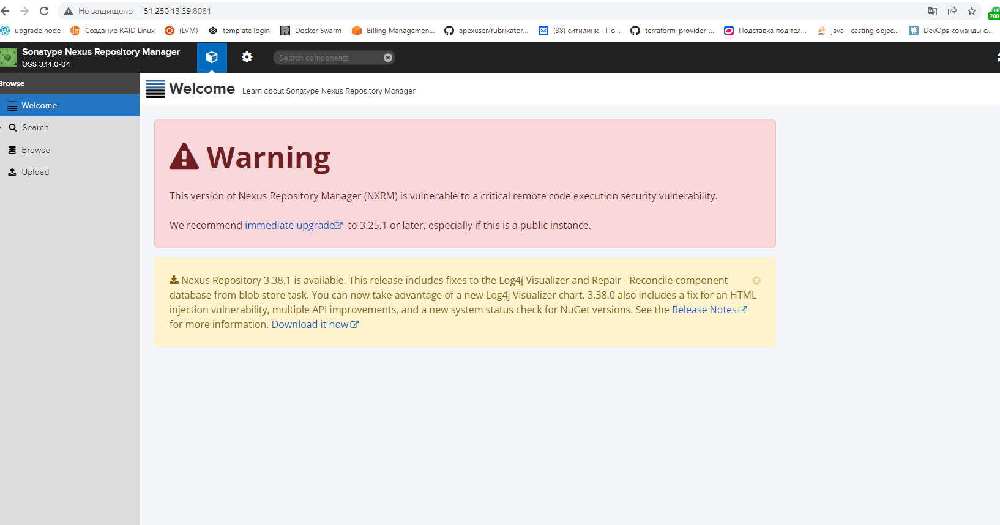

VM Cloud
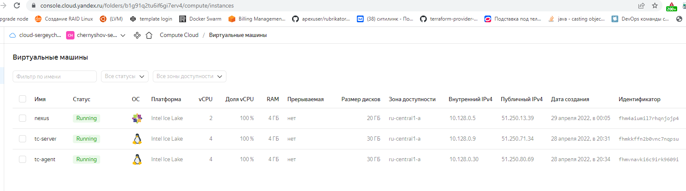

#Основная часть
1. Создайте новый проект в teamcity на основе fork

Проект на основе скопированного репозитория создан
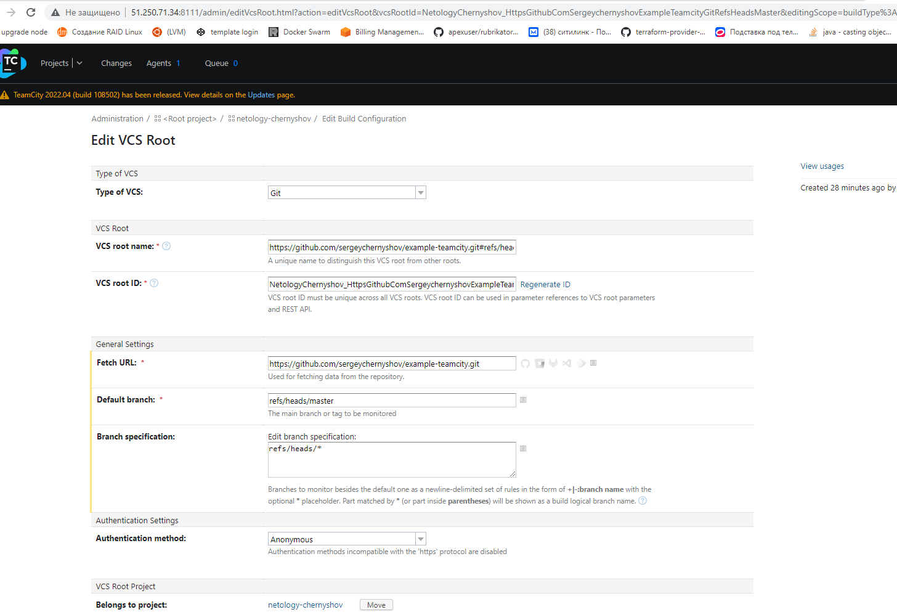

2. Сделайте autodetect конфигурации

Указал сборку по Commit в репозитории

3. Сохраните необходимые шаги, запустите первую сборку master'a

Первая сборка
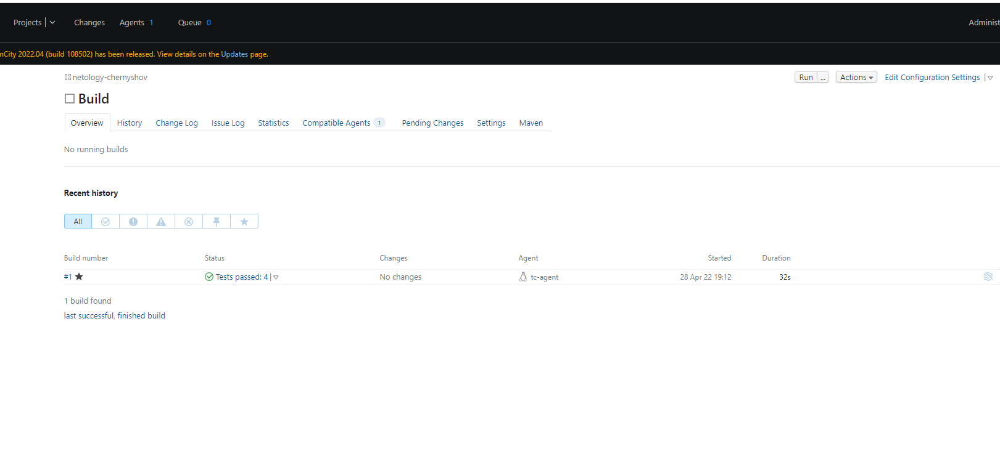

4. Поменяйте условия сборки: если сборка по ветке master, то должен происходит mvn clean deploy, иначе mvn clean test

Добавил шаг в сборке, указал условия выполнения
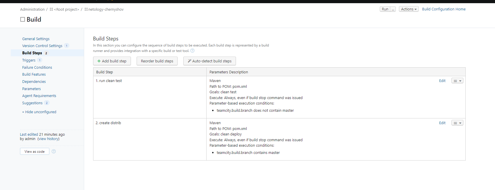

5. Для deploy будет необходимо загрузить settings.xml в набор конфигураций maven у teamcity, предварительно записав туда креды для подключения к nexus

Добавил файл settings.xml для подключения к Nexus
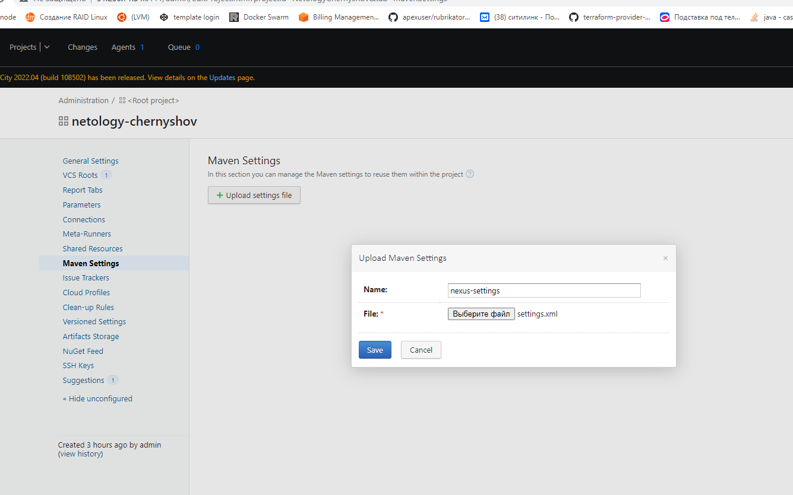

Указал файл settings.xml в проекте
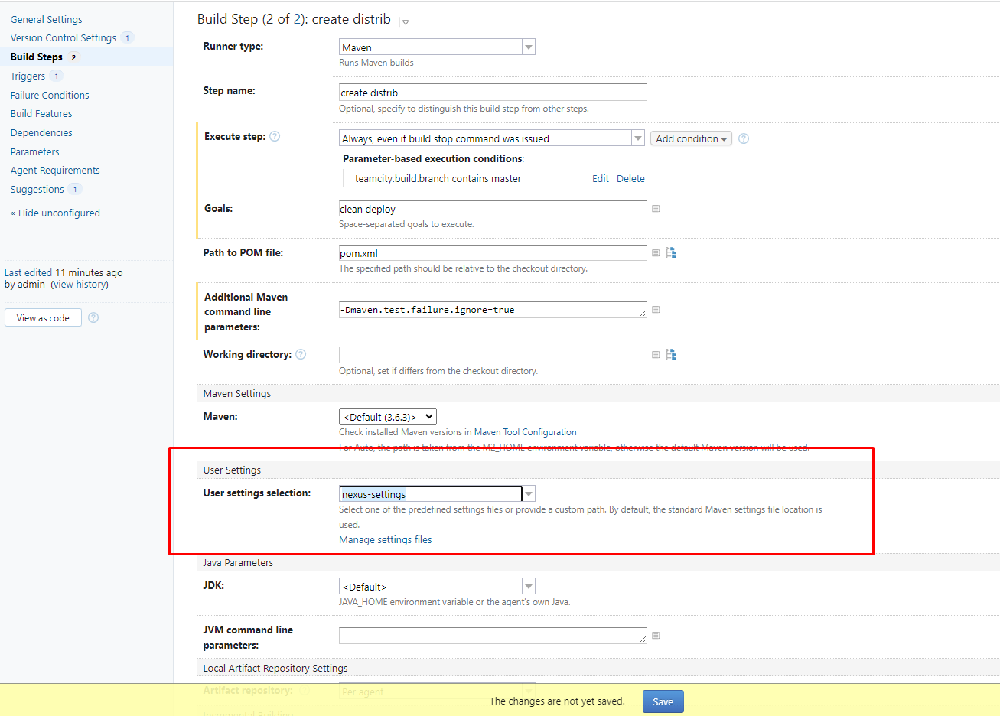

6. В pom.xml необходимо поменять ссылки на репозиторий и nexus

Изменил ссылки на репозиторий

7. Запустите сборку по master, убедитесь что всё прошло успешно, артефакт появился в nexus

Сборка прошла, артефакт в Nexus
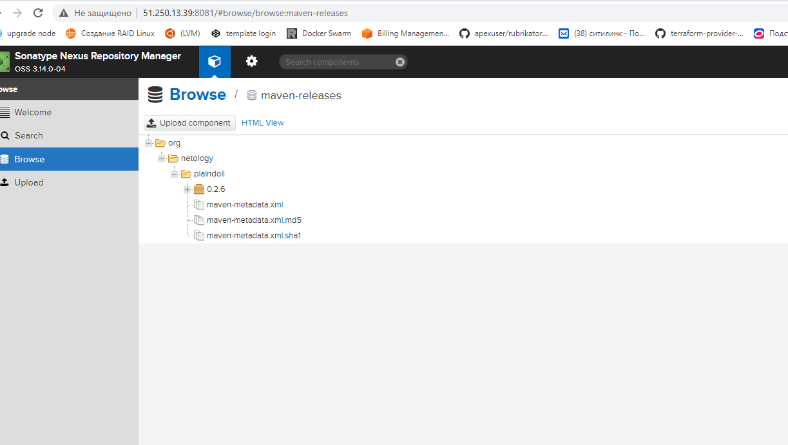

8. Мигрируйте build configuration в репозиторий

Конфигурация выгружена
[ссылка](https://github.com/sergeychernyshov/example-teamcity)

9. Создайте отдельную ветку feature/add_reply в репозитории

Создал ветку feature/add_reply

10. Напишите новый метод для класса Welcomer: метод должен возвращать произвольную реплику, содержащую слово hunter

Добавил метод sayStatusGreate

11. Дополните тест для нового метода на поиск слова hunter в новой реплике

Дописал тест

12. Сделайте push всех изменений в новую ветку в репозиторий

Запушил изменения

13. Убедитесь что сборка самостоятельно запустилась, тесты прошли успешно

Все тесты прошли успешно
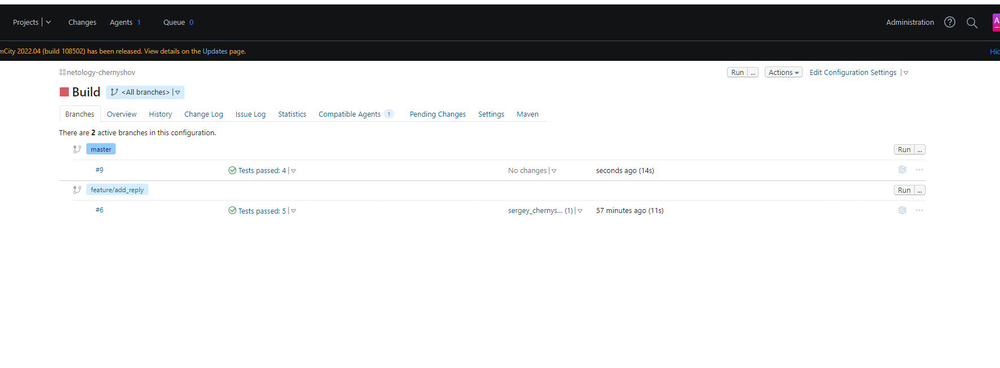

14. Внесите изменения из произвольной ветки feature/add_reply в master через Merge

Сделал Merge
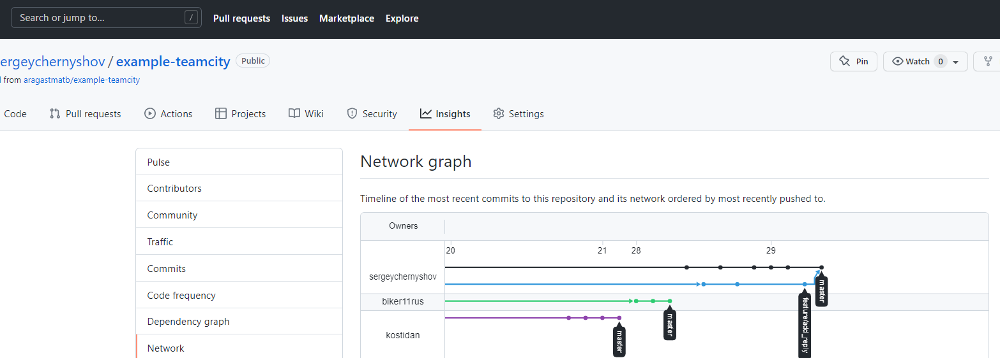

15. Убедитесь, что нет собранного артефакта в сборке по ветке master

В Nexus один артефакт

16. Настройте конфигурацию так, чтобы она собирала .jar в артефакты сборки

Добавил настройку для сборки JAR

17. Проведите повторную сборку мастера, убедитесь, что сбора прошла успешно и артефакты собраны

Артефакты собраны
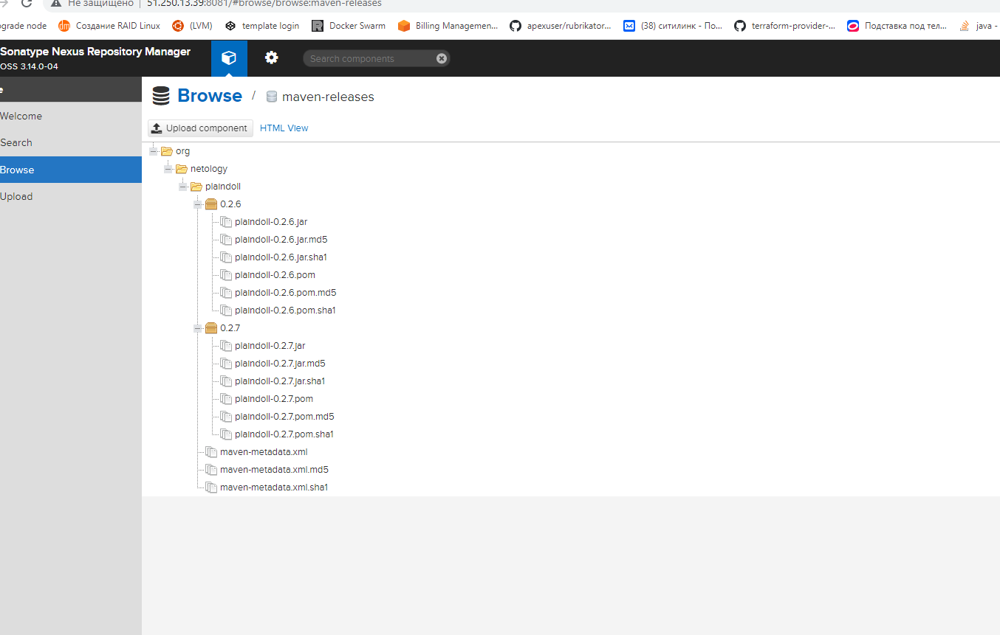

18. Проверьте, что конфигурация в репозитории содержит все настройки конфигурации из teamcity

Проверил

19. В ответ предоставьте ссылку на репозиторий

[Ссылка на репозиторий](https://github.com/sergeychernyshov/example-teamcity)

