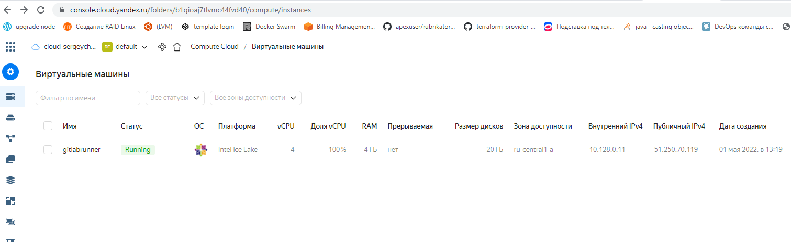
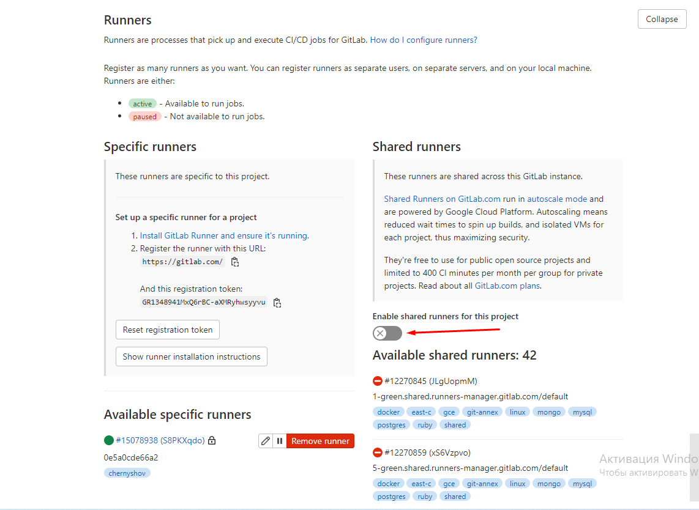
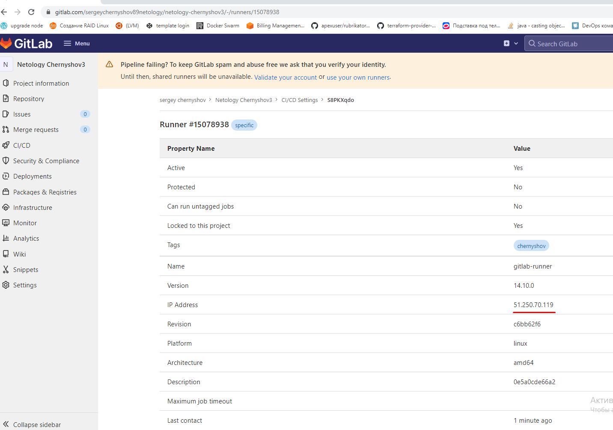
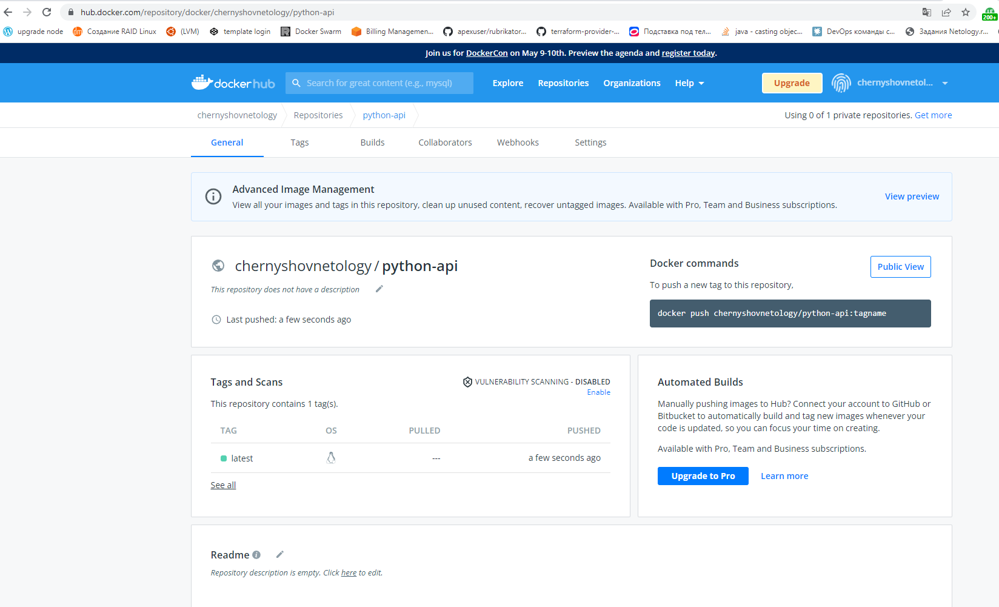
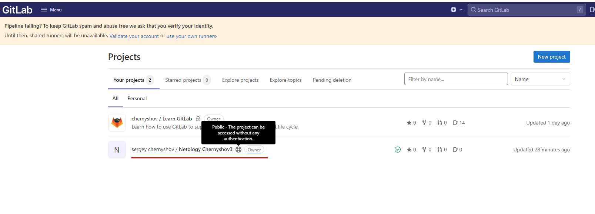

# Подготовка к выполнению

1. Необходимо зарегистрироваться

Готово.
   
2. Создайте свой новый проект

Создал проект "Netology Chernyshov3"

3. Создайте новый репозиторий в gitlab, наполните его файлами

[Ссылка на репозиторий](https://gitlab.com/sergeychernyshov89netology/netology-chernyshov3)

Gitlab не захотел собирать проект без ввода данных о карте.
Для исправления ситуации создал свой Runner

Подключил Runner к проекту, выключил использование других Runner

Для хранения образов подключил https://hub.docker.com/

Образы помещаю в свое хранилище.

Скачать образ можно следующим образом

>docker run -d --rm --name python-api -p 5290:5290  chernyshovnetology/python-api:latest

4. Проект должен быть публичным, остальные настройки по желанию

Проект публичный

# Основная часть

## DevOps

В репозитории содержится код проекта на python. Проект - RESTful API сервис. Ваша задача автоматизировать сборку образа с выполнением python-скрипта:

1. Образ собирается на основе centos:7

2. Python версии не ниже 3.7

3. Установлены зависимости: flask flask-jsonpify flask-restful

4. Создана директория /python_api

5. Скрипт из репозитория размещён в /python_api

6. Точка вызова: запуск скрипта

7. Если сборка происходит на ветке master: Образ должен пушится в docker registry вашего gitlab python-api:latest, иначе этот шаг нужно пропустить

## Product Owner

Вашему проекту нужна бизнесовая доработка: необходимо поменять JSON ответа на вызов метода GET /rest/api/get_info, необходимо создать Issue в котором указать:

1. Какой метод необходимо исправить

2. Текст с { "message": "Already started" } на { "message": "Running"}

3. Issue поставить label: feature

## Developer

Вам пришел новый Issue на доработку, вам необходимо:

1. Создать отдельную ветку, связанную с этим issue

2. Внести изменения по тексту из задания

3. Подготовить Merge Requst, влить необходимые изменения в master, проверить, что сборка прошла успешно

## Tester

Разработчики выполнили новый Issue, необходимо проверить валидность изменений:

1. Поднять докер-контейнер с образом python-api:latest и проверить возврат метода на корректность

2. Закрыть Issue с комментарием об успешности прохождения, указав желаемый результат и фактически достигнутый

## Итог

После успешного прохождения всех ролей - отправьте ссылку на ваш проект в гитлаб, как решение домашнего задания

[Ссылка на GitLab репозиторий](https://gitlab.com/sergeychernyshov89netology/netology-chernyshov3)